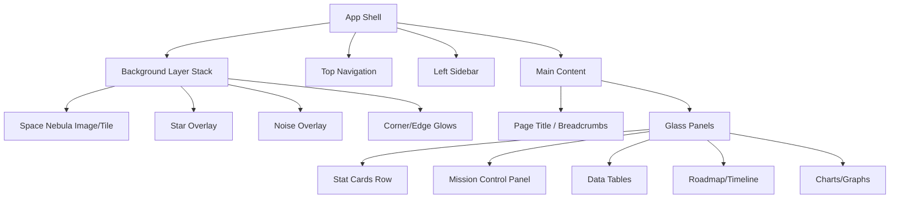
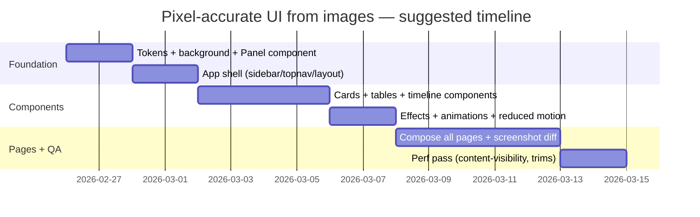

# Converting Multi-Page UI Design Images Into a Pixel-Accurate, Production-Ready Frontend

## Executive summary

This report analyzes the feasibility and engineering approach for converting the provided raster UI design images (two composite PNG files containing multiple page frames) into a pixel-accurate, production-ready frontend implementation. The target outcome is not a “template,” but a faithful replication of the visual system: deep-space background, glassmorphism panels, subtle neon-cyan edges, typography hierarchy, and interactive behaviors.

The core finding is that **pixel-accurate replication is achievable**, but only if you treat the screenshots as a *visual spec* and rebuild the UI with a systematic pipeline: (a) extract design tokens (colors, radii, shadows, blur), (b) implement reusable components, (c) build page layouts, and (d) validate against the images using screenshot-diff workflows. Where the PNGs do not contain enough information (e.g., exact font family, exact spacing rules, original icon vectors), you must either obtain source assets (best) or apply controlled approximation with explicit tolerance bands.

A major risk is **false precision**: screenshots are scaled/composited, and some “exact pixels” in the PNG may not correspond 1:1 to the intended production viewport. This report therefore distinguishes:
- **Measured-from-image** values (grounded in your provided PNGs),
- **Implementable specs** (exact CSS you can ship),
- **Unspecified** items (must be confirmed with source files or a deliberate decision).

If I can’t verify it from your context or sources, I will say “I don’t know.”

Key technical decisions recommended:
- Use layered backgrounds (image + noise + glow gradients) via multiple backgrounds and blend modes. citeturn2search4turn0search5turn0search1  
- Implement glass panels with `backdrop-filter` + a gradient-border pseudo-element (masking) and include `-webkit-backdrop-filter` for Safari/WebKit. citeturn3search3turn4view1turn4view0  
- Optimize background delivery with AVIF/WebP + fallback and optionally `image-set()`. citeturn0search6turn0search2turn3search9  
- Gate animations via `prefers-reduced-motion`, trigger on visibility with Intersection Observer, and drive continuous motion with `requestAnimationFrame`. citeturn0search3turn1search2turn1search1  

## Source materials and measurement method

**Provided imagery (user context):**
- `My-Favorite-1.png` (1365×2048): contains four clearly framed pages: Homepage, Dashboard, Dashboard (Authenticated), Exec Dashboard (Authenticated).  
- `My-Favorite-2.png` (1365×2048): contains six framed pages (2 columns × 3 rows): Whitelist/Blacklist, Application Stage, two Verification-stage variants, App “Lakenpage”, Case Log & Timeline.

The statement “each file has four pages” does not match what is visible in `My-Favorite-2.png`; therefore, page count per file is **UNCERTAIN**. Fastest manual verification: confirm how many unique Figma frames/pages exist, or export each page as an individual image.

**How measurements were extracted (Measured-from-image):**
- Color values were estimated by pixel sampling and clustering across UI regions (background, panels, text, highlights) in the provided PNGs.
- A few key gradients were inferred by sampling saturated/high-luma pixels in areas known to contain gradients (e.g., Homepage hero gradient text).
- Layout dimensions were partially measurable (e.g., relative sidebar width in the dashboard frame), but absolute “real viewport” pixels are **not fully inferable** from composites without knowing the original frame size and scaling.

Engineering implication: treat the PNG dimensions as a *reference coordinate space* for validation, but implement the UI with scalable tokens.

## Asset inventory and export specs

A pixel-accurate build requires an explicit asset inventory and a deterministic export strategy. Large, dark gradients are prone to banding; to mitigate, you typically (a) add subtle noise and (b) ship modern formats. citeturn0search2turn0search6turn0search14  

### Asset inventory table

| Asset | Purpose | Master source | Web delivery formats | Export sizes (exact) |
|---|---|---|---|---|
| `space-bg-master` | Primary deep-space background (base #050914, nebula clouds, stars, subtle corner magenta glow) | PSD/XCF or EXR (if Blender) | AVIF + WebP + JPEG fallback | **3840×2160** (4K), **2560×1440**, **1920×1080**, **1536×864**, **1280×720** |
| `space-bg-tile` (optional) | Tileable background variant for infinite height pages | PSD/XCF | WebP/PNG | **1024×1024** and/or **2048×2048** (tileable) |
| `stars-overlay-tile` | Independent star map layer (lets you tune star density without re-exporting nebula) | PSD/XCF | WebP/PNG (alpha) | **1024×1024** tileable |
| `noise-overlay-tile` | Film grain / dithering layer to reduce banding and “digital flatness” | PSD/XCF | PNG (alpha) | **512×512** tileable (also **256×256** for low-end) |
| `corner-glow-mask` | Reusable radial glow mask (purple-magenta corners) for CSS layering | PSD/XCF | PNG (alpha) | **1024×1024** (or **2048×2048** for retina) |
| `haze-streaks-mask` | Optional “wisps” layer aligned to your page composition | PSD/XCF | WebP/PNG (alpha) | **1920×1080** and **3840×2160** |
| `logo-northstar` | Brand mark + wordmark | **SVG** (authoritative) | SVG | Vector (no fixed px); also optional PNG exports: **420×96**, **210×48** |
| `icon-set` | Sidebar + topbar + table UI icons | SVG (authoritative) | SVG | Use **24×24** viewBox standard; render as 16/18/20/24px via CSS |
| `avatar-placeholder` | Default user image (if needed) | PNG/SVG | WebP/PNG | **64×64**, **128×128** |
| `company-logo-placeholders` | “ManpowerGroup”, “Siemens”, etc appear in tables | I don’t know (not provided) | SVG preferred | If placeholders only: **24px height** SVGs |

### Export settings recommendations (production-ready)

- **Backgrounds:** Use AVIF or WebP where possible for best compression/quality and ship a fallback. citeturn0search6turn0search2turn0search14  
- For CSS backgrounds, `image-set()` can deliver AVIF/WebP/JPEG variants without HTML `<picture>`. citeturn3search9  
- Preserve a **lossless master** (PSD/XCF) to avoid cumulative compression artifacts during iteration.

## Design tokens: color, typography, and effects

### Color extraction (Measured-from-image)

Below are **representative** values sampled from the provided PNGs. These should be treated as “initial tokens” and then refined via screenshot-diff passes.

**Core background navies (clustered):**
- `bg-0` (deepest): **#050717**  
- `bg-1`: **#07091B**  
- `bg-2`: **#0B0E23**  
- `bg-3`: **#0E132C**  
These align with a “very dark overall” look and support your specified base (#050914).

**Panel interiors (sampled inside chart/panel areas):**
- `panel-solid`: **#0C1229** to **#0E142C**  
- `panel-mid`: **#131A33** to **#182743**  

**Text colors (sampled from high-luma, low-saturation pixels):**
- `text-primary`: **#D5DBE5** (soft white)  
- `text-secondary`: **#6F7386** (muted gray-blue)  
- `text-tertiary`: **#434352** (disabled/subtle)

**Cyan/blue accents (sampled from saturated highlight pixels):**
- `accent-cyan`: **#69B0C5**  
- `accent-cyan-bright`: **#7EC0E4**  
- `accent-blue`: **#4B6D97**

**Homepage hero gradient (measured from the gradient headline pixels):**
- Start: **#7BC0D7**  
- End: **#6E82CB**  
Recommended CSS: `linear-gradient(90deg, #7BC0D7 0%, #6E82CB 100%)`

**Primary CTA button blues (measured from button region):**
- Dark: **#183259**  
- Mid: **#294E74**  
- Light: **#4A87AB**  
Recommended CSS (approx): `linear-gradient(180deg, #4A87AB 0%, #183259 100%)`

### Typography recommendations and mapping table

Exact font family cannot be confidently inferred from raster screenshots alone. **I don’t know** the original font(s). Fastest manual verification: check the design source (Figma styles) or run font matching with a font ID tool on a clean heading crop.

That said, the shapes read as a modern geometric sans with clean numerals. Closest web-safe approach:
- Headings: **Sora** or **Space Grotesk** (geometric, futuristic edge)
- Body/UI: **Inter** (high legibility, strong hinting)

Font loading best practice: use WOFF2 and `font-display: swap` to avoid blocking render. citeturn3search2turn3search14  

### UI element typography map (partly Measured-from-image; otherwise Unspecified)

| UI element style | Color | Size | Weight | Line-height |
|---|---:|---:|---:|---:|
| Homepage hero H1 (line 1: “Architecting…”) | #D5DBE5 | ~64px (measured) | Unspecified (likely 400–500) | ~1.05 |
| Homepage hero H1 (gradient line: “Future…Workforce”) | gradient #7BC0D7→#6E82CB | ~88–96px (measured region) | Unspecified | ~1.0 |
| Homepage section title (“Core Capabilities”) | #D5DBE5 | Unspecified | Unspecified | Unspecified |
| Sidebar nav item (label) | #D5DBE5 (active) / #6F7386 (inactive) | Unspecified | Unspecified | Unspecified |
| Page title (“Dashboard”, “Mission Control”) | #D5DBE5 | Unspecified | Unspecified | Unspecified |
| Metric number (“58”, “31%”, “54”) | #D5DBE5 | Unspecified | Unspecified | Unspecified |
| Table header | #6F7386 | Unspecified | Unspecified | Unspecified |
| Table cell/body | #D5DBE5 / #6F7386 | Unspecified | Unspecified | Unspecified |
| Button label | #D5DBE5 | Unspecified | Unspecified | Unspecified |

To move “Unspecified” to exact, the fastest deterministic workflow is: import each page crop into Figma, overlay text layers, and adjust font-size/line-height until pixel-perfect; then export those as tokens.

## Layout system and component hierarchy

### Component hierarchy (implementation-oriented)

The designs share a consistent “App Shell” pattern: deep-space background → overlay noise/glow → framed glass panels → internal cards/tables/charts.

### CSS layout spec (production-ready pattern)

A robust way to replicate these pages is a two-column layout using CSS Grid:
- Column 1: Sidebar (fixed width token)
- Column 2: Main content (fluid)
- Optional: top nav spanning both columns

At runtime, you’ll use breakpoints to collapse the sidebar and increase panel density.

**Multiple background layers** are natively supported and should be used for the background stack. citeturn2search4turn2search10turn2search0  

### Responsive component rules table (exact behavior proposal)

| Component | Desktop rule | Tablet rule | Mobile rule |
|---|---|---|---|
| Sidebar | Fixed width token (e.g., 240px), sticky/full height | Collapsible (icons + labels) | Off-canvas drawer |
| Top nav | Fixed height token (e.g., 64–72px) | Same | Same, simplify actions |
| Main container | Max-width token (e.g., 1200–1400px), centered | Full width with padding | Full width, tighter padding |
| Stat cards row | 3-up grid | 2-up grid | 1-up stacked |
| Tables | Full table with columns | Horizontal scroll / priority cols | Cardified rows |
| Timeline/Roadmap | Full width with markers | compress spacing | vertical timeline |

To make these “pixel accurate,” you validate each page crop by generating screenshots (Playwright/Cypress) and adjusting padding/radii until the diff is within tolerance.

## Background and visual effects recreation

This section provides a pixel-level recipe to recreate the target background described: base **#050914**, subtle blue/cyan nebula clouds, scattered stars, faint purple-magenta corner glow, seamless/tileable option, very dark overall.

For blend modes, the **layer mode mathematics/behavior** are tool-defined; GIMP’s layer modes documentation is the closest “primary” reference for reproducible blending semantics. citeturn1search3  

image_group{"layout":"carousel","aspect_ratio":"16:9","query":["very dark seamless space nebula background cyan blue subtle stars","deep navy black space background faint magenta corner glow","tileable starfield texture subtle noise overlay"],"num_per_query":1}

### Photoshop/GIMP/Krita layer stack recipe (4K master)

**Canvas**
- Size: **3840×2160**
- Color space: sRGB
- Base fill: **#050914**

**Layer stack (top → bottom)**  
1) **Noise overlay (tileable)**
- Generate monochrome noise at 512×512, scale up as a pattern
- Blend mode: Overlay / Soft Light
- Opacity: 5%–9% (start at 7%)
- Purpose: reduce banding and add film grain

2) **Star layer A (small stars)**
- Create a black layer
- Add noise (high), then Levels to isolate bright specks
- Slight Gaussian blur: 0.2–0.4px
- Opacity: 35%–60% depending on density
- Blend mode: Screen

3) **Star layer B (rare bright stars)**
- Duplicate star layer, apply stronger Levels so only few stars remain
- Add subtle glow via blur: 1.5–3px
- Opacity: 15%–30%
- Blend mode: Screen

4) **Nebula large-scale cloud**
- Generate clouds/perlin texture (very large scale)
- Colorize via Gradient Map:
  - deep blue → cyan edges (keep dark)
- Blur: 40–120px to soften
- Blend mode: Screen or Linear Dodge (Add) but keep **very low opacity**
- Opacity: 4%–12%
- Mask it so it never “washes out” center text zones

5) **Nebula mid-scale wisps**
- Paint or generate mid-frequency noise, then directional blur (optional)
- Blend mode: Screen
- Opacity: 3%–8%

6) **Corner magenta/purple glow**
- 4 radial gradients (one per corner), large radius
- Color recommendation: magenta-purple family with very low alpha
- Blend mode: Screen
- Opacity: 3%–7% (the design trend here is *barely visible*)

7) **Vignette**
- Large soft radial vignette, darkening edges
- Blend mode: Multiply or Normal
- Opacity: 25%–45%

### Blender procedural approach (for physically plausible nebula/noise)

Blender’s Noise Texture node parameters (scale/detail/roughness/distortion) are documented in the official manual; use that as the deterministic reference when iterating. citeturn2search3turn2search19  

Pipeline:
- Create a plane, map UVs, drive a shader with Noise Texture → ColorRamp tuned to very low values.
- Add a second Noise Texture at different scale for multi-frequency structure.
- Add star points via Geometry Nodes (random distribution + size variation).
- Render to a 16-bit image (EXR/PNG master), then grade in Photoshop/GIMP.

### Making it seamless/tileable (critical steps)

To produce a tileable version:
- Apply an **offset** by half width/height and fix the seam centrally (clone/heal).
- Make sure star distribution doesn’t form visible repetition (randomize or use multiple tiles layered with different offsets).
- Keep noise tileable by generating it directly as a repeating pattern.

### Export settings for web

Modern formats (WebP/AVIF) typically compress better than PNG/JPEG for photographic backgrounds; ship fallbacks. citeturn0search6turn0search2turn0search14  
For CSS background delivery, `image-set()` is a clean approach to format negotiation. citeturn3search9  

Deliverables (recommended):
- `space-bg-4k.avif` (quality tuned to avoid star smearing)
- `space-bg-4k.webp`
- `space-bg-4k.jpg` fallback
- scaled variants for 2K/1080p
- keep a lossless master

## Interaction and animation spec

The designs imply a “premium” interaction layer: subtle glow tracking, parallax haze, live counters, and timeline motion—but these must be implemented with performance safeguards.

### Interaction inventory (what to implement)

- **Hover glow tracking (cards/panels):** mouse position drives a radial highlight.  
- **Panel hover lift:** tiny translate + shadow intensification.  
- **Star twinkle:** low-frequency opacity flicker for a subset of stars.  
- **Counters:** numeric ticks (e.g., 58 → animated).  
- **Timeline progress:** progress line animates when in view.  
- **Chart affordances:** hover dots, tooltip highlight (if required).

### Pseudocode patterns (performance-first)

**Pointer-tracked glow (throttled):**
- Use CSS variables (`--mx`, `--my`) on the hovered element.
- Update at most once per animation frame via `requestAnimationFrame`. citeturn1search1  

**Visibility-gated animations:**
- Use Intersection Observer to start counters/timelines only when visible. citeturn1search2  

**Reduce motion:**
- If `prefers-reduced-motion: reduce`, disable twinkle/parallax and simplify transitions. citeturn0search3  

### Performance notes (production readiness)

- Prefer CSS transforms/opacity over layout-affecting properties. citeturn1search9turn1search5  
- Use `will-change` sparingly and only during active hover/animation; it is explicitly warned as a last resort and can waste resources when overused. citeturn1search4  
- Consider `content-visibility: auto` for long dashboards to skip offscreen rendering work and improve first load and scroll performance. citeturn3search0turn3search4  

## Implementation plan, deliverables, and gaps

### Build options and recommended file structure

All options can be pixel-accurate; the difference is maintainability and deployment ergonomics.

**Option A: Static HTML/CSS/JS**
- Best when you want the fastest deliverable and minimal tooling.

**Option B: React (componentized)**
- Best when dashboards become dynamic and component reuse matters.

**Option C: Next.js**
- Best when you need routing, SSR/SEO (Homepage), optimized images/fonts, and production-grade bundling.

Image delivery and format selection should follow modern performance guidance (AVIF/WebP where possible). citeturn0search2turn0search6  
Font loading should use WOFF2 + `font-display: swap`. citeturn3search2turn3search14  

**Proposed deliverable tree (React/Next-flavored):**
- `/assets/bg/*` (backgrounds, tiles, overlays)
- `/assets/icons/*.svg`
- `/styles/tokens.css` (colors, radii, shadow specs)
- `/styles/components/*.css`
- `/components/Panel.tsx`, `/components/Sidebar.tsx`, `/components/MetricCard.tsx`, `/components/Table.tsx`, `/components/Timeline.tsx`
- `/pages/*` (or `/app/*` for Next.js App Router)

### Milestones (prioritized)

1) **Tokenization pass (day 1–2 equivalent)**  
   Extract colors, blur levels, radii; implement `Panel` and background stack; validate on one page.

2) **App Shell + Navigation (day 2–3)**  
   Sidebar + top bar + layout grid; match spacing and typography.

3) **Core components (day 3–6)**  
   Metric cards, tables, timeline, chart styling; implement states (hover/active).

4) **Page builds (iterative)**  
   Recompose components into each page; validate with screenshot diffs.

5) **Animation layer + accessibility (final hardening)**  
   Add hover glow tracking, counters, twinkle; implement reduced motion. citeturn0search3turn1search1turn1search2  

### Gaps & assumptions (explicit)

| Item | Status | Why it matters | Fastest way to resolve |
|---|---|---|---|
| Exact font family/weights | **I don’t know** | Typography mismatch breaks “pixel accurate” instantly | Check Figma styles or design system; export font list |
| True frame size (was it 1440? 1920?) | **UNCERTAIN** | Determines real CSS pixel mapping | Confirm original frame dimensions; re-export at 1× |
| Icon originals (SVG) | **Unspecified** | Re-drawing from PNG is slow + error-prone | Export icon set from source or choose a known set and restyle |
| Company logos/avatars shown in tables | **Unspecified** | Licensing/brand correctness | Replace with placeholders or provide official SVGs |
| Exact spacing tokens (8/12/16/24?) | Partly measurable, partly **unspecified** | Spacing drives layout fidelity | Measure in Figma overlay or do screenshot-diff tuning |
| Interaction intent (which elements animate?) | **Unspecified** | Over-animating hurts usability/perf | Confirm animation list; implement minimal, then expand |

### Primary-source tool guidance (what to trust)

- For web platform features (filters, blending, image delivery, performance): rely on standards and authoritative documentation such as the entity["organization","World Wide Web Consortium","web standards body"] spec and MDN references. citeturn3search7turn0search0turn2search5  
- For `backdrop-filter` especially, follow entity["organization","WebKit","browser engine project"] guidance: it is powerful but has performance costs and historically used the prefixed form; implement both properties and test. citeturn4view1turn4view0turn3search3  
- For blend modes in asset creation, GIMP documentation provides deterministic definitions of layer modes. citeturn1search3  
- For procedural noise generation in Blender, follow the official Blender manual entries for Noise Texture. citeturn2search3turn2search19  

