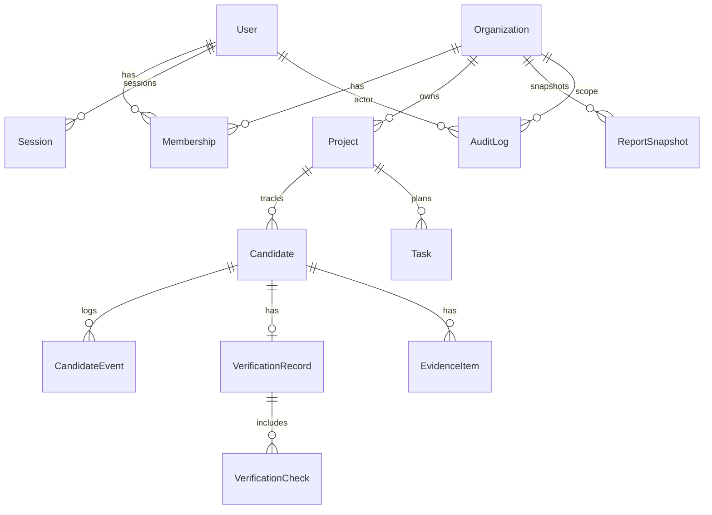
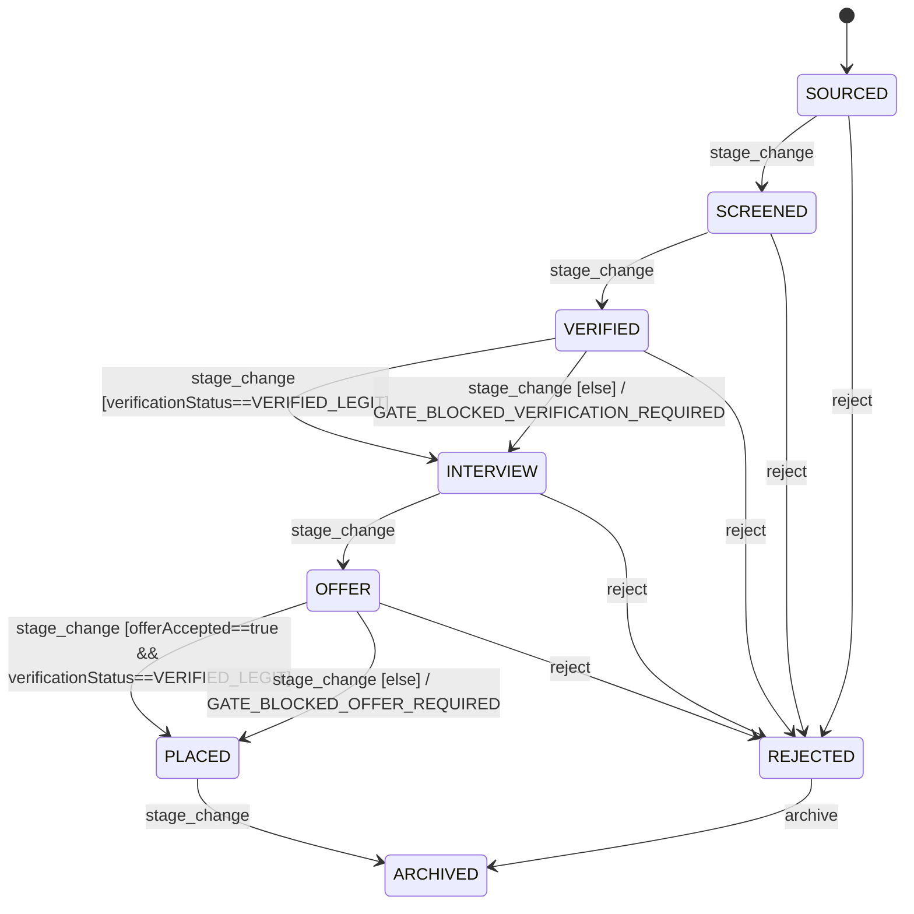

# NorthStar Production Implementation Plan

## Executive summary

This report specifies a production-ready implementation plan for **NorthStar** as a premium AI job‑sourcing agency platform: a **public marketing website**, an **authenticated client operations dashboard**, and an **admin console**.

If a claim cannot be verified from the currently available project files or the cited sources in this report, it is explicitly marked **“I don’t know”** or **UNSPECIFIED**.

**Primary constraint (project evidence)**: In this session’s mounted files, only one internal “research” document is available: fileciteturn0file0. The **research/** and **reports/** folders you referenced are **not accessible here**, so this plan is grounded in (a) that internal conversion spec and (b) authoritative public documentation and security references. Where your internal build specs/route contracts might override defaults, those items are marked **UNSPECIFIED** and written to be easy to reconcile once the missing files are provided.

**Core recommendation**: Build NorthStar as a single **Next.js App Router** codebase (marketing + app + admin), using **Route Handlers** for APIs and a strict contract-first backend (Prisma schema + OpenAPI + seed data + tests). Next.js Route Handlers are designed for creating custom request handlers inside the App Router. citeturn0search3turn0search25

**Key production decisions (high confidence)**:
- **Frontend**: Next.js App Router + TypeScript + Tailwind + shadcn primitives wrapped by NorthStar functional components. Next.js provides Route Handlers in the `app` directory and a production checklist emphasizing server components, route handlers, and streaming/loading UI. citeturn0search3turn0search6  
- **Backend**: Route Handlers + service layer + Prisma ORM with PostgreSQL. Prisma documents best practices for production migration via `prisma migrate deploy`. citeturn0search14turn2search9  
- **Database**: PostgreSQL, with multi-tenant isolation via `Organization` + membership. (Optional “defense in depth” via Postgres Row Level Security is supported by PostgreSQL policy mechanisms, but is optional depending on team maturity.) citeturn2search2turn2search16  
- **Auth**: Cookie-based session management with secure cookie attributes and explicit authorization checks per resource; Next.js’s auth guidance separates authentication, session management, and authorization. citeturn3search9turn0search1turn3search7  
- **Infra**: Host the Next.js app on entity["company","Vercel","serverless hosting"] and run managed Postgres on entity["company","Render","cloud hosting"] with PITR backups. citeturn1search1turn1search0  
- **CI/CD**: Use entity["company","GitHub","code hosting"] Actions with encrypted secrets to run tests and apply migrations in deployment workflows. citeturn1search2turn0search14  
- **Security baseline**: Implement OWASP-aligned session management, password storage, HTTPS-only APIs, input validation, rate limiting, and object-level authorization (BOLA prevention). citeturn0search1turn3search0turn3search1turn0search11turn3search23  
- **Testing**: Use Playwright visual comparisons (`toHaveScreenshot`) for pixel/structure drift detection and E2E route validation. citeturn0search2turn0search5  
- **API documentation**: Provide an OpenAPI 3.1 spec (OpenAPI docs require a `paths` field OR `components`/`webhooks`, and define a standard interface description for APIs). citeturn1search3turn1search15turn1search11  

**Known unknowns** (must remain unspecified until design sources are provided):
- Fonts, exact spacing scale, final token values, and some icon vectors cannot be reliably inferred from composite PNG frames alone; the internal design conversion report explicitly flags this class of constraints. (UNSPECIFIED; align later with your Figma/source assets.) fileciteturn0file0

## System architecture and stack

### Architecture overview

NorthStar should be implemented as a **multi-tenant SaaS**:

- **Marketing website**: SEO-first, conversion CTAs, contact intake.
- **Client dashboard**: case pipeline, verification gate workflow, analytics, interview prep, reports.
- **Admin console**: user/org management, configs, review queues, audit logs, operational tooling.

### Stack recommendation

**Frontend**
- Next.js (App Router) + TypeScript
- Tailwind CSS
- shadcn primitives wrapped into NorthStar functional components (inventory later)

Rationale: Next.js App Router supports Route Handlers and production patterns including server components and streaming/loading UI. citeturn0search3turn0search6  

**Backend**
- Next.js Route Handlers for HTTP API surface (REST)
- A service layer (`/server/services/*`) and data layer (`/server/db/*`) to prevent route handlers becoming “business logic soup”

Route Handlers are designed for defining custom request handlers using the Web Request / Response APIs and are only available inside the `app` directory. citeturn0search3turn0search25  

**Database**
- PostgreSQL
- Prisma ORM

Prisma provides a typed ORM flow for PostgreSQL and production guidance for migration workflows (especially `migrate deploy`). citeturn0search10turn2search9  

**Authentication & sessions**
- Recommended baseline: cookie-based sessions (server-issued session id) with:
  - HttpOnly + Secure + SameSite configuration aligned to session hardening recommendations (OWASP)
  - CSRF protection on state-changing requests

Session management binds the user’s authentication state to HTTP traffic and must be protected. citeturn0search1turn0search35  
Next.js’s authentication guidance explicitly separates **authentication**, **session management**, and **authorization** as distinct concerns. citeturn3search9turn2search11  

**Infrastructure**
- App hosting: entity["company","Vercel","serverless hosting"]
- Database hosting: entity["company","Render","cloud hosting"] PostgreSQL with point-in-time recovery

Render documents continuous backups and point-in-time recovery windows for paid Postgres. citeturn1search1turn1search5  
Vercel documents environment variables and environment management best practices. citeturn1search0turn1search12turn1search24  

**CI/CD**
- entity["company","GitHub","code hosting"] Actions:
  - lint/typecheck/unit tests
  - integration tests using ephemeral Postgres
  - e2e tests (Playwright)
  - build checks
  - migration checks (`prisma migrate deploy`) during deployment workflow

GitHub documents secure secret usage in Actions. citeturn1search2turn1search6  
Prisma recommends `prisma migrate deploy` for production and describes its role in CI/CD, including advisory locking. citeturn2search9turn2search1  

**Observability**
- Error + performance monitoring: entity["company","Sentry","app monitoring"] integrated with Vercel marketplace drains

Vercel highlights marketplace integrations for observability; Sentry is available as an integration. citeturn2search25turn2search10turn2search17  

### Environment variables and secrets

- Use `.env*` locally and platform env stores in production.
- Never commit `.env*` files; Next.js references a standard load order and warns not to commit `.env` files. citeturn0search0turn1search0  
- Only expose client-safe env vars using the `NEXT_PUBLIC_` prefix (otherwise keep server-only). citeturn0search0  

## Route map

### Full route list

**Public marketing**
- `/`
- `/about`
- `/services`
- `/process`
- `/industries`
- `/case-studies`
- `/pricing`
- `/faq`
- `/contact`
- `/login`
- `/signup`

**Authenticated app**
- `/app` (redirect to `/app/dashboard`)
- `/app/dashboard`
- `/app/projects`
- `/app/projects/[projectId]`
- `/app/pipeline`
- `/app/pipeline/[candidateId]`
- `/app/verification`
- `/app/verification/[candidateId]`
- `/app/interview-prep`
- `/app/reports`
- `/app/settings`

**Admin**
- `/app/admin`
- `/app/admin/orgs`
- `/app/admin/users`
- `/app/admin/projects`
- `/app/admin/review-queue`
- `/app/admin/audit-logs`
- `/app/admin/system`

UNSPECIFIED: Any additional routes mandated by your inaccessible “reports/” specs.

## Data model and Prisma schema

### Data model design goals

- **Multi-tenant isolation**: every business object belongs to an `Organization`.
- **Principle of least privilege**: use membership roles and enforce authorization per request.
- **Auditability**: stage transitions, verification decisions, and admin actions must be logged.
- **Operational reporting**: compute metrics from event logs and/or snapshots.

PostgreSQL supports row-level security policies if you choose to enforce additional DB-level isolation. citeturn2search2turn2search16  

### Prisma schema

Below is a **Prisma-style schema** designed to support the full platform. It is written to be implementable without relying on visual design.

```prisma
// prisma/schema.prisma
generator client {
  provider = "prisma-client-js"
}

datasource db {
  provider = "postgresql"
  url      = env("DATABASE_URL")
}

enum UserRole {
  CLIENT
  ADMIN
}

enum OrgRole {
  OWNER
  MANAGER
  ANALYST
  VIEWER
}

enum ProjectStatus {
  DRAFT
  ACTIVE
  PAUSED
  CLOSED
}

enum CandidateStage {
  SOURCED
  SCREENED
  VERIFIED
  INTERVIEW
  OFFER
  PLACED
  REJECTED
  ARCHIVED
}

enum VerificationStatus {
  VERIFIED_LEGIT
  VERIFIED_RISK
  UNKNOWN_INSUFFICIENT_EVIDENCE
}

enum RiskLevel {
  LOW
  MEDIUM
  HIGH
}

enum TaskStatus {
  OPEN
  IN_PROGRESS
  BLOCKED
  DONE
  CANCELED
}

enum ReportType {
  PIPELINE_VELOCITY
  CONVERSION_FUNNEL
  RISK_DISTRIBUTION
  TIME_TO_STAGE
  SKILL_PROGRESS
}

enum AuditAction {
  USER_LOGIN
  USER_LOGOUT
  USER_CREATED
  USER_ROLE_CHANGED
  ORG_CREATED
  ORG_MEMBER_ADDED
  ORG_MEMBER_ROLE_CHANGED
  PROJECT_CREATED
  PROJECT_UPDATED
  CANDIDATE_CREATED
  CANDIDATE_STAGE_CHANGED
  VERIFICATION_UPDATED
  REPORT_GENERATED
  SYSTEM_SETTING_UPDATED
}

model User {
  id             String   @id @default(cuid())
  email          String   @unique
  passwordHash   String?  // if using credentials auth; null for SSO-only
  role           UserRole @default(CLIENT)
  isEmailVerified Boolean @default(false)

  profile        UserProfile?
  memberships    Membership[]
  sessions       Session[]
  createdAt      DateTime @default(now())
  updatedAt      DateTime @updatedAt
  deletedAt      DateTime?

  auditLogs      AuditLog[] @relation("AuditActor")
}

model UserProfile {
  id          String @id @default(cuid())
  userId      String @unique
  displayName String
  title       String?
  timezone    String?
  locale      String? // "en-US", etc.

  user        User @relation(fields: [userId], references: [id], onDelete: Cascade)
  createdAt   DateTime @default(now())
  updatedAt   DateTime @updatedAt
}

model Organization {
  id          String @id @default(cuid())
  name        String
  website     String?
  industry    String?
  sizeBand    String? // e.g. "1-10", "11-50"
  status      String? // e.g. "ACTIVE", "SUSPENDED"

  memberships Membership[]
  projects    Project[]
  contacts    ContactSubmission[]

  createdAt   DateTime @default(now())
  updatedAt   DateTime @updatedAt
}

model Membership {
  id             String  @id @default(cuid())
  userId         String
  organizationId String
  orgRole        OrgRole @default(VIEWER)

  user           User         @relation(fields: [userId], references: [id], onDelete: Cascade)
  organization   Organization @relation(fields: [organizationId], references: [id], onDelete: Cascade)

  @@unique([userId, organizationId])
  createdAt      DateTime @default(now())
  updatedAt      DateTime @updatedAt
}

model Session {
  id        String   @id @default(cuid())
  userId    String
  tokenHash String   @unique // hash of session token (never store raw)
  expiresAt DateTime

  user      User     @relation(fields: [userId], references: [id], onDelete: Cascade)
  createdAt DateTime @default(now())
  revokedAt DateTime?
}

model EmailVerificationToken {
  id        String   @id @default(cuid())
  userId    String
  tokenHash String   @unique
  expiresAt DateTime
  usedAt    DateTime?

  user      User     @relation(fields: [userId], references: [id], onDelete: Cascade)
  createdAt DateTime @default(now())
}

model PasswordResetToken {
  id        String   @id @default(cuid())
  userId    String
  tokenHash String   @unique
  expiresAt DateTime
  usedAt    DateTime?

  user      User     @relation(fields: [userId], references: [id], onDelete: Cascade)
  createdAt DateTime @default(now())
}

model Project {
  id             String        @id @default(cuid())
  organizationId String
  name           String
  roleTitle      String
  roleLevel      String?
  locationType   String?       // remote/hybrid/onsite
  locationText   String?
  description    String?
  status         ProjectStatus @default(ACTIVE)
  priority       Int           @default(3) // 1 high, 5 low
  targetStartAt  DateTime?
  targetHireAt   DateTime?

  organization   Organization @relation(fields: [organizationId], references: [id], onDelete: Cascade)
  candidates     Candidate[]
  tasks          Task[]
  reportSnapshots ReportSnapshot[]

  createdAt      DateTime @default(now())
  updatedAt      DateTime @updatedAt

  @@index([organizationId, status])
}

model Candidate {
  id              String             @id @default(cuid())
  organizationId  String
  projectId       String
  fullName        String
  email           String?
  phone           String?
  linkedinUrl     String?
  portfolioUrl    String?
  resumeUrl       String?
  sourceType      String?            // e.g. "linkedin", "referral", "job_board"
  stage           CandidateStage     @default(SOURCED)
  stageUpdatedAt  DateTime           @default(now())

  verificationStatus VerificationStatus @default(UNKNOWN_INSUFFICIENT_EVIDENCE)
  riskLevel       RiskLevel          @default(LOW)
  score           Int                @default(0) // internal scoring
  notes           String?

  project         Project            @relation(fields: [projectId], references: [id], onDelete: Cascade)
  events          CandidateEvent[]
  verification    VerificationRecord?
  evidence        EvidenceItem[]
  interviews      InterviewSession[]
  offers          Offer[]
  tags            CandidateTag[]

  createdAt       DateTime @default(now())
  updatedAt       DateTime @updatedAt

  @@index([organizationId, projectId])
  @@index([projectId, stage])
}

model CandidateEvent {
  id           String   @id @default(cuid())
  candidateId  String
  organizationId String
  type         String   // "NOTE", "STAGE_CHANGE", "VERIFICATION", "EMAIL_SENT", ...
  payloadJson  Json
  createdById  String?
  createdAt    DateTime @default(now())

  candidate    Candidate @relation(fields: [candidateId], references: [id], onDelete: Cascade)

  @@index([candidateId, createdAt])
  @@index([organizationId, createdAt])
}

model VerificationRecord {
  id              String             @id @default(cuid())
  candidateId     String             @unique
  status          VerificationStatus @default(UNKNOWN_INSUFFICIENT_EVIDENCE)
  riskLevel       RiskLevel          @default(LOW)
  summary         String?
  analystNotes    String?
  verifiedByUserId String?
  verifiedAt      DateTime?

  candidate       Candidate          @relation(fields: [candidateId], references: [id], onDelete: Cascade)
  checks          VerificationCheck[]
  createdAt       DateTime @default(now())
  updatedAt       DateTime @updatedAt
}

model VerificationCheck {
  id              String   @id @default(cuid())
  verificationId  String
  checkType       String   // "IDENTITY", "EMPLOYMENT", "EDUCATION", "FRAUD_SIGNAL", ...
  result          String   // "PASS", "FAIL", "WARN", "UNKNOWN"
  confidence      Int      @default(0) // 0-100
  detailsJson     Json
  createdAt       DateTime @default(now())

  verification    VerificationRecord @relation(fields: [verificationId], references: [id], onDelete: Cascade)

  @@index([verificationId, createdAt])
}

model EvidenceItem {
  id             String @id @default(cuid())
  candidateId    String
  kind           String // "LINK", "DOCUMENT", "SCREENSHOT", "NOTE"
  url            String?
  label          String?
  contentText    String?
  metadataJson   Json?
  createdAt      DateTime @default(now())

  candidate      Candidate @relation(fields: [candidateId], references: [id], onDelete: Cascade)

  @@index([candidateId, createdAt])
}

model InterviewSession {
  id            String @id @default(cuid())
  candidateId   String
  scheduledAt   DateTime?
  format        String? // "phone", "video", "onsite"
  interviewer   String?
  outcome       String? // "PASS", "FAIL", "NEXT", ...
  notes         String?
  createdAt     DateTime @default(now())

  candidate     Candidate @relation(fields: [candidateId], references: [id], onDelete: Cascade)

  @@index([candidateId, createdAt])
}

model Offer {
  id            String @id @default(cuid())
  candidateId   String
  status        String // "DRAFT", "SENT", "ACCEPTED", "DECLINED"
  salaryText    String?
  startDate     DateTime?
  notes         String?
  createdAt     DateTime @default(now())

  candidate     Candidate @relation(fields: [candidateId], references: [id], onDelete: Cascade)

  @@index([candidateId, createdAt])
}

model CandidateTag {
  id          String @id @default(cuid())
  candidateId String
  tag         String

  candidate   Candidate @relation(fields: [candidateId], references: [id], onDelete: Cascade)

  @@unique([candidateId, tag])
}

model Task {
  id             String     @id @default(cuid())
  organizationId String
  projectId      String?
  title          String
  description    String?
  status         TaskStatus @default(OPEN)
  dueAt          DateTime?
  assignedToId   String?
  createdById    String?

  project        Project?   @relation(fields: [projectId], references: [id], onDelete: SetNull)
  createdAt      DateTime @default(now())
  updatedAt      DateTime @updatedAt

  @@index([organizationId, status])
  @@index([projectId, status])
}

model ReportSnapshot {
  id             String     @id @default(cuid())
  organizationId String
  projectId      String?
  type           ReportType
  fromDate       DateTime
  toDate         DateTime
  metricsJson    Json

  project        Project?   @relation(fields: [projectId], references: [id], onDelete: SetNull)
  createdAt      DateTime @default(now())

  @@index([organizationId, type, createdAt])
}

model ContactSubmission {
  id             String @id @default(cuid())
  organizationId String?
  name           String
  email          String
  company        String?
  message        String
  status         String @default("NEW") // NEW/CONTACTED/CLOSED
  createdAt      DateTime @default(now())

  organization   Organization? @relation(fields: [organizationId], references: [id], onDelete: SetNull)
}

model SystemSetting {
  id        String @id @default(cuid())
  key       String @unique
  valueJson Json
  updatedByUserId String?
  updatedAt DateTime @updatedAt
  createdAt DateTime @default(now())
}

model AuditLog {
  id             String      @id @default(cuid())
  organizationId String?
  actorUserId    String?
  action         AuditAction
  entityType     String
  entityId       String?
  ip             String?
  userAgent      String?
  detailsJson    Json?
  createdAt      DateTime @default(now())

  actor          User? @relation("AuditActor", fields: [actorUserId], references: [id], onDelete: SetNull)

  @@index([organizationId, createdAt])
  @@index([actorUserId, createdAt])
}
```

Prisma’s production workflow documentation emphasizes `prisma migrate deploy` as the command to apply existing migrations in production, and describes advisory locking safeguards. citeturn2search9turn2search1  

### Entity relationship diagram



### DB models table

This table is an implementation index (not a substitute for the schema).

| Model | Purpose | Key relations |
|---|---|---|
| User | Auth identity + global role | memberships, sessions, auditLogs |
| Membership | Multi-tenant access + org role | user ↔ organization |
| Organization | Tenant boundary | projects, members, reports |
| Project | Client job-sourcing project | candidates, tasks, reports |
| Candidate | Candidate pipeline object | events, verification, evidence |
| VerificationRecord | Hard-gate verification summary | checks, candidate |
| EvidenceItem | Supporting evidence for verification | candidate |
| CandidateEvent | Timeline log (append-only) | candidate |
| Task | Operational tasks per org/project | project optional |
| ReportSnapshot | Persisted computed metrics | org/project optional |
| ContactSubmission | Marketing intake | optional org linkage |
| Session | Cookie-session backing store | user |
| Email/Reset tokens | Auth lifecycle | user |
| AuditLog | Compliance + admin trace | actor, org scope |

## API contracts and service conventions

### API style, versioning, and documentation

- Use Next.js **Route Handlers** under `app/api/**/route.ts` for all API entrypoints. citeturn0search3turn0search25  
- Publish OpenAPI 3.1 YAML at `public/openapi.yaml` and expose it at `/api/openapi` (static) and optionally a Swagger UI page (optional).
- OpenAPI defines a vendor-neutral interface description for HTTP APIs. citeturn1search15turn1search3  

### Request/response standards

**Headers**
- `Content-Type: application/json`
- `X-Request-Id: <uuid>` (generated if absent)

**Standard success envelope**
```json
{
  "ok": true,
  "data": { }
}
```

**Standard error envelope**
```json
{
  "ok": false,
  "error": {
    "code": "STRING_CODE",
    "message": "Human readable message",
    "requestId": "uuid",
    "details": { }
  }
}
```

**HTTP status mapping**
- `200/201` success
- `400` validation error
- `401` unauthenticated
- `403` unauthorized
- `404` resource not found (after auth checks)
- `409` conflict (e.g., concurrent stage update)
- `429` rate limited
- `500` unexpected

### Authentication and authorization rules

- Use secure session cookies and ensure session management is robust (OWASP). citeturn0search1turn0search35  
- Authorization must be enforced **object-by-object**, not just at route level; OWASP API risk guidance highlights broken object level authorization (BOLA/IDOR) as a central risk class. citeturn3search23turn3search7  

### Pagination rules

- Default page size for list endpoints: `limit=25` (max 100).
- Prefer **cursor-based pagination** for large datasets / infinite scrolling. Prisma explicitly documents cursor-based pagination as scaling better by relying on indexed columns rather than traversing skipped rows. citeturn3search12  

**Cursor pattern**
- Request: `GET /api/candidates?limit=25&cursor=<candidateId>`
- Response includes `nextCursor` if more data exists.

### API endpoint inventory

Below is a complete contract list grouped by domain. “Auth” indicates who may call it.

#### Public endpoints

**Contact intake**
- `POST /api/contact`
  - Auth: public (rate limited)
  - Body:
    ```json
    { "name": "string", "email": "string", "company": "string?", "message": "string" }
    ```
  - Response:
    ```json
    { "ok": true, "data": { "submissionId": "cuid" } }
    ```

#### Auth endpoints

Next.js environment variable handling and separation of server-only vs public variables should be respected for secrets. citeturn0search0  

- `POST /api/auth/signup`
  - Auth: public (rate limited)
  - Body: `{ "email": "string", "password": "string" }`
  - Response: `{ "ok": true, "data": { "userId": "cuid", "emailVerificationSent": true } }`

- `POST /api/auth/verify-email`
  - Auth: public
  - Body: `{ "token": "string" }`
  - Response: `{ "ok": true, "data": { "verified": true } }`

- `POST /api/auth/login`
  - Auth: public (rate limited; lockout/backoff)
  - Body: `{ "email": "string", "password": "string" }`
  - Response sets HttpOnly cookie and returns `{ "ok": true, "data": { "user": {...} } }`

- `POST /api/auth/logout`
  - Auth: authenticated
  - Response: `{ "ok": true, "data": { "loggedOut": true } }`

- `POST /api/auth/forgot-password`
  - Auth: public (rate limited)
  - Body: `{ "email": "string" }`
  - Response: `{ "ok": true, "data": { "sent": true } }` (always true to avoid account enumeration)

- `POST /api/auth/reset-password`
  - Auth: public
  - Body: `{ "token": "string", "newPassword": "string" }`
  - Response: `{ "ok": true, "data": { "reset": true } }`

#### Organization and membership

- `GET /api/me`
  - Auth: authenticated
  - Response includes user profile + memberships (orgs)

- `POST /api/orgs`
  - Auth: authenticated
  - Body: `{ "name": "string", "industry": "string?" }`
  - Authorization: any authenticated user (creates org; becomes OWNER)

- `GET /api/orgs`
  - Auth: authenticated
  - Returns orgs user belongs to

- `POST /api/orgs/:orgId/members`
  - Auth: authenticated
  - Authorization: OWNER/MANAGER
  - Body: `{ "email": "string", "orgRole": "MANAGER|ANALYST|VIEWER" }`

- `PATCH /api/orgs/:orgId/members/:memberId`
  - Auth: authenticated
  - Authorization: OWNER
  - Body: `{ "orgRole": "..." }`

#### Projects

- `GET /api/projects?orgId=...&limit=&cursor=`
  - Auth: authenticated
  - Authorization: member of org
  - Cursor pagination

- `POST /api/projects`
  - Auth: authenticated
  - Authorization: org member (MANAGER+ recommended)
  - Body: `{ "orgId":"cuid","name":"string","roleTitle":"string", "description":"string?" }`

- `GET /api/projects/:projectId`
  - Auth: authenticated
  - Authorization: org member

- `PATCH /api/projects/:projectId`
  - Auth: authenticated
  - Authorization: MANAGER+

#### Candidates and pipeline

- `GET /api/candidates?projectId=...&stage=...&limit=&cursor=`
  - Auth: authenticated
  - Authorization: org member
  - Cursor pagination

- `POST /api/candidates`
  - Auth: authenticated
  - Authorization: ANALYST+ (recommended)
  - Body includes candidate fields + projectId

- `GET /api/candidates/:candidateId`
  - Auth: authenticated
  - Authorization: org member

- `PATCH /api/candidates/:candidateId`
  - Auth: authenticated
  - Authorization: ANALYST+

- `POST /api/candidates/:candidateId/stage`
  - Auth: authenticated
  - Authorization: ANALYST+
  - Body: `{ "toStage": "CandidateStage", "expectedStage": "CandidateStage" }`
  - Enforces verification gate rules (specified next section)
  - Returns `409` if optimistic concurrency fails (`expectedStage` mismatch)

#### Candidate timeline/events

- `GET /api/candidates/:candidateId/events?limit=&cursor=`
  - Auth: authenticated
  - Authorization: org member

- `POST /api/candidates/:candidateId/events`
  - Auth: authenticated
  - Authorization: ANALYST+
  - Body: `{ "type":"string","payload":{} }`

#### Verification

- `GET /api/verification/:candidateId`
  - Auth: authenticated
  - Authorization: org member

- `POST /api/verification/:candidateId`
  - Auth: authenticated
  - Authorization: ANALYST+
  - Creates or replaces verification record

- `PATCH /api/verification/:candidateId`
  - Auth: authenticated
  - Authorization: ANALYST+
  - Body:
    ```json
    { "status":"VERIFIED_LEGIT|VERIFIED_RISK|UNKNOWN_INSUFFICIENT_EVIDENCE", "riskLevel":"LOW|MEDIUM|HIGH", "analystNotes":"string?" }
    ```

- `POST /api/verification/:candidateId/checks`
  - Auth: authenticated
  - Authorization: ANALYST+
  - Body: `{ "checkType":"string","result":"PASS|FAIL|WARN|UNKNOWN","confidence":0,"details":{} }`

#### Interview prep

- `GET /api/interview-prep?projectId=...`
  - Auth: authenticated
  - Authorization: org member
  - Returns question bank + user artifacts (drafts/checklists)

- `POST /api/interview-prep/questions`
  - Auth: authenticated
  - Authorization: ANALYST+
  - Adds internal question item (optional)

- `PUT /api/interview-prep/answers/:questionId`
  - Auth: authenticated
  - Authorization: org member
  - Body: `{ "answerText":"string","confidenceScore":0 }`

#### Reports

- `GET /api/reports/types`
  - Auth: authenticated
  - Authorization: org member
  - Returns enumerated report types supported

- `POST /api/reports/generate`
  - Auth: authenticated
  - Authorization: MANAGER+
  - Body: `{ "orgId":"cuid","projectId":"cuid?","type":"ReportType","from":"YYYY-MM-DD","to":"YYYY-MM-DD" }`

- `GET /api/reports/snapshots?orgId=...&type=...&limit=&cursor=`
  - Auth: authenticated
  - Authorization: org member

- `GET /api/reports/snapshots/:snapshotId`
  - Auth: authenticated
  - Authorization: org member

#### Settings

- `PATCH /api/settings/profile`
  - Auth: authenticated
  - Body: `{ "displayName":"string", "title":"string?" }`

- `PATCH /api/settings/password`
  - Auth: authenticated
  - Body: `{ "currentPassword":"string","newPassword":"string" }`

#### Admin

- `GET /api/admin/health`
  - Auth: ADMIN only

- `GET /api/admin/users?limit=&cursor=`
  - Auth: ADMIN only

- `PATCH /api/admin/users/:userId`
  - Auth: ADMIN only
  - Body: `{ "role":"CLIENT|ADMIN", "deletedAt":"date|null" }`

- `GET /api/admin/orgs?limit=&cursor=`
  - Auth: ADMIN only

- `GET /api/admin/review-queue?limit=&cursor=`
  - Auth: ADMIN only
  - Returns candidates with `verificationStatus=UNKNOWN_INSUFFICIENT_EVIDENCE` or flagged risk

- `GET /api/admin/audit-logs?limit=&cursor=`
  - Auth: ADMIN only

- `PATCH /api/admin/system/settings`
  - Auth: ADMIN only
  - Body: `{ "key":"string","value":{} }`

### Routes vs APIs table

This table maps the UI routes to required API calls (minimum viable).

| Route | Primary APIs required |
|---|---|
| `/` | (none) |
| `/services` | (none) |
| `/pricing` | (none) |
| `/contact` | `POST /api/contact` |
| `/login` | `POST /api/auth/login`, `POST /api/auth/forgot-password` |
| `/signup` | `POST /api/auth/signup`, `POST /api/auth/verify-email` |
| `/app/dashboard` | `GET /api/me`, `GET /api/projects`, `GET /api/reports/snapshots` |
| `/app/projects` | `GET /api/projects`, `POST /api/projects` |
| `/app/projects/[projectId]` | `GET /api/projects/:projectId`, `GET /api/candidates` |
| `/app/pipeline` | `GET /api/candidates`, `POST /api/candidates/:id/stage` |
| `/app/pipeline/[candidateId]` | `GET /api/candidates/:id`, `GET /api/candidates/:id/events`, `POST /api/candidates/:id/events` |
| `/app/verification` | `GET /api/candidates (filter by verificationStatus)`, `GET /api/verification/:candidateId` |
| `/app/verification/[candidateId]` | `GET /api/verification/:candidateId`, `PATCH /api/verification/:candidateId`, `POST /api/verification/:candidateId/checks` |
| `/app/interview-prep` | `GET /api/interview-prep`, `PUT /api/interview-prep/answers/:questionId` |
| `/app/reports` | `GET /api/reports/types`, `POST /api/reports/generate`, `GET /api/reports/snapshots` |
| `/app/settings` | `PATCH /api/settings/profile`, `PATCH /api/settings/password` |
| `/app/admin/*` | `/api/admin/*` family |

### Sample JSON responses

**Get current user**
```json
{
  "ok": true,
  "data": {
    "user": {
      "id": "ckx1...",
      "email": "client@example.com",
      "role": "CLIENT",
      "isEmailVerified": true
    },
    "profile": {
      "displayName": "Jose",
      "title": "Talent Ops Lead",
      "locale": "en-US"
    },
    "memberships": [
      {
        "organizationId": "org1...",
        "orgRole": "OWNER",
        "organization": { "id": "org1...", "name": "NorthStar Demo Org" }
      }
    ]
  }
}
```

**List candidates (cursor pagination)**
```json
{
  "ok": true,
  "data": {
    "items": [
      {
        "id": "cand1...",
        "projectId": "proj1...",
        "fullName": "A. Candidate",
        "stage": "SCREENED",
        "verificationStatus": "UNKNOWN_INSUFFICIENT_EVIDENCE",
        "riskLevel": "LOW",
        "stageUpdatedAt": "2026-02-26T09:10:00.000Z"
      }
    ],
    "nextCursor": "cand1..."
  }
}
```

**Attempt stage change blocked by verification gate**
```json
{
  "ok": false,
  "error": {
    "code": "GATE_BLOCKED_VERIFICATION_REQUIRED",
    "message": "Cannot move candidate to INTERVIEW until verificationStatus is VERIFIED_LEGIT.",
    "requestId": "6d6b2e2a-6c6f-4a17-92bd-9c0c7afee8f1",
    "details": {
      "candidateId": "cand1...",
      "fromStage": "VERIFIED",
      "toStage": "INTERVIEW",
      "verificationStatus": "UNKNOWN_INSUFFICIENT_EVIDENCE",
      "requiredVerificationStatus": "VERIFIED_LEGIT"
    }
  }
}
```

## Verification gates and pipeline state machine

### Pipeline stages

Candidate progression is modeled as:

`SOURCED → SCREENED → VERIFIED → INTERVIEW → OFFER → PLACED → ARCHIVED`  
with terminal rejection path: `REJECTED → ARCHIVED`

### Verification gate rules

Hard-gate rules (enforced server-side in `POST /api/candidates/:id/stage`):

- **Entering VERIFIED** requires at least one `VerificationRecord` (even if status remains unknown).
- **Entering INTERVIEW** requires `verificationStatus == VERIFIED_LEGIT`.
- **Entering OFFER** requires:
  - `verificationStatus == VERIFIED_LEGIT`
  - no `RiskLevel == HIGH` OR an explicit override flag (admin-only, audited)
- **Entering PLACED** requires:
  - offer exists with status `ACCEPTED`
  - verification is still `VERIFIED_LEGIT` at time of placement

All gate failures must return deterministic error codes and must be audited.

These rules implement “authorization + workflow control” as a first-class backend concern, consistent with the general need to avoid broken-object and broken-process security failures. citeturn3search7turn3search23  

### State machine diagram



### Implementation details

- Use an **optimistic concurrency** field (or `expectedStage` in requests) to prevent silent overwrites in concurrent operations.
- Write stage changes as:
  - update candidate stage
  - append `CandidateEvent` with type `STAGE_CHANGE`
  - append `AuditLog` entry with action `CANDIDATE_STAGE_CHANGED`
  - all in a single transaction (`prisma.$transaction`) for atomicity. Prisma documents transaction patterns for dependent writes. citeturn2search30  

## Operations, security, testing, and QA gates

### Deployment and infrastructure plan

**Deploy topology**
- App: Next.js deployed to entity["company","Vercel","serverless hosting"].
- DB: Postgres on entity["company","Render","cloud hosting"].

**Backups**
- Enable Render PITR for Postgres (paid tiers) and document the recovery window in runbooks. citeturn1search1turn1search5  

**Secrets**
- Use Vercel environment variable management and avoid committing `.env` files. citeturn0search0turn1search0  
- Use GitHub Actions secrets for CI workflows. citeturn1search2  

**Migrations**
- Run `prisma migrate deploy` in CI/CD (not manually), using advisory locking safeguards. citeturn2search9turn2search1  

### Security requirements

This is a minimal production baseline aligned to OWASP guidance:

- **HTTPS only** for all endpoints and all auth traffic. citeturn3search1  
- **Password storage**: hash passwords with a modern password hashing algorithm and never store raw passwords; OWASP provides guidance for safe password storage. citeturn3search0  
- **Session management**: secure, unpredictable session tokens; HttpOnly cookies; rotation/revocation; protect against fixation and theft per OWASP session guidance. citeturn0search1turn0search35  
- **Input validation**: validate and normalize on server boundaries (payload size limits, allowed character sets, strict schemas for API bodies). citeturn0search11  
- **Rate limiting**: apply especially to `/api/auth/login`, `/api/auth/signup`, `/api/contact`, `/api/auth/forgot-password` (credential stuffing and brute force are explicitly called out as common failure modes). citeturn0search35turn3search11  
- **Authorization**: enforce per-resource authorization (org membership + role), and prevent IDOR/BOLA. citeturn3search7turn3search23  
- **Logging & audit**: record admin and workflow actions (stage changes, verification updates, role changes) into `AuditLog`.

### Testing strategy

**Unit tests**
- Pure functions (state machine validation, gate evaluator, authorization checks).

**Integration tests**
- Route Handlers + DB (ephemeral Postgres), covering migrations + queries.

**E2E tests**
- Playwright for authenticated flows, route protection, CRUD, and workflow gates.

**Visual diff**
- Playwright visual comparisons with `expect(page).toHaveScreenshot()` to detect regression in key pages and to support the pixel-accuracy workflow described in your internal UI conversion spec. citeturn0search2  
- Add **ARIA snapshots** for accessibility structure stability (optional but high value). citeturn0search5  

### QA acceptance gates table

Each route is “Done” only if it passes these QA gates.

| Route | Acceptance gates |
|---|---|
| `/` | No broken links; performance budget met; Lighthouse baseline recorded (UNSPECIFIED exact thresholds) |
| `/services` | Content loads; CTAs route correctly |
| `/pricing` | CTA routes; pricing content renders; analytics event emitted (UNSPECIFIED provider) |
| `/contact` | Validations; rate limits; DB persists submission; success state |
| `/login` | Rate limits; correct session cookie set; redirect to `/app/dashboard`; error state on invalid creds |
| `/signup` | Rate limits; verification email workflow; no account enumeration leaks |
| `/app/dashboard` | Auth required; correct org-scoped data; loading/empty/error states |
| `/app/projects` | Auth required; create/list/update; pagination stable |
| `/app/projects/[projectId]` | Auth required; membership enforced; 404 only after auth; candidate list loads |
| `/app/pipeline` | Auth required; stage transitions audited; gate failures return deterministic codes |
| `/app/verification` | Auth required; verification records editable; evidence list stable |
| `/app/interview-prep` | Auth required; user drafts persist; proper org scoping |
| `/app/reports` | Auth required; report generation deterministic; export works (CSV minimum) |
| `/app/settings` | Auth required; profile update persists; password change requires current password |
| `/app/admin/*` | Admin-only server enforcement; all actions audited; pagination for logs stable |

## Implementation roadmap, onboarding, and handoff artifacts

### Sprint plan and backlog

Two-week sprints, designed to ship vertical slices early. (Exact team capacity is UNSPECIFIED; tasks are structured to be trivially split across 2–4 engineers.)

| Sprint | Goal | Jira/Linear-ready tasks (mini-tasks included) |
|---|---|---|
| Sprint A | Foundation | Repo bootstrap; lint/typecheck; env strategy; Prisma schema + migrations; seed scaffolding; Route Handler skeletons; auth/session skeleton; org membership guard middleware |
| Sprint B | Core app slice | `/signup` + `/login` + `/app/dashboard`; org/project CRUD; candidate list; audit logging; basic error schema everywhere; Playwright E2E happy path |
| Sprint C | Pipeline engine | Candidate stage endpoints; verification record + checks; gate evaluator; stage transition transaction + events; admin review queue stub; integration tests for gates |
| Sprint D | Reports & interview prep | Report generation endpoints + snapshots; `/app/reports` UI wired; interview prep drafts endpoints + UI; export CSV; more E2E coverage |
| Sprint E | Admin hardening | `/app/admin/*` pages; user/org management; system settings; audit log viewer; rate limiting + abuse protections; monitoring wired |
| Sprint F | Production hardening | Visual diff tests; load/perf checks; backup/runbook docs; OpenAPI spec + Postman/Insomnia exports; final QA gate runs per route |

### UI component inventory

Functional wrappers only (no design decisions embedded). These wrappers enforce consistent behavior and reduce page-level styling drift.

- `AppShell` (layout + route protection boundary)
- `AuthGuard` (server-side and/or middleware enforcement)
- `OrgScopeProvider` (active org context + validation)
- `DataTable` (pagination, sorting, empty/error/loading states)
- `Form` (schema validation, submit state, server error mapping)
- `StageBadge` + `RiskBadge` (status mapping only)
- `Drawer` / `Modal` (focus trap, escape close, accessibility)
- `Timeline` (renders CandidateEvent stream)
- `ChartFrame` (render host for reports; pluggable chart lib)
- `Toast` (global notifications)
- `AuditLogViewer` (admin)
- `ErrorBoundary` (client and server variants)

UNSPECIFIED: exact token mapping and styling wrappers; to be aligned with your design conversion spec and tokens once final design sources exist. fileciteturn0file0

### Folder and repo structure

A pragmatic single-repo structure that keeps Route Handlers thin and pushes logic into services:

```txt
/
  app/
    (marketing)/
      page.tsx
      about/page.tsx
      services/page.tsx
      process/page.tsx
      industries/page.tsx
      pricing/page.tsx
      faq/page.tsx
      contact/page.tsx
    (auth)/
      login/page.tsx
      signup/page.tsx
    app/                      # URL segment /app
      layout.tsx              # AppShell
      dashboard/page.tsx
      projects/page.tsx
      projects/[projectId]/page.tsx
      pipeline/page.tsx
      pipeline/[candidateId]/page.tsx
      verification/page.tsx
      verification/[candidateId]/page.tsx
      interview-prep/page.tsx
      reports/page.tsx
      settings/page.tsx
      admin/
        layout.tsx
        page.tsx
        orgs/page.tsx
        users/page.tsx
        projects/page.tsx
        review-queue/page.tsx
        audit-logs/page.tsx
        system/page.tsx

    api/
      auth/
        signup/route.ts
        login/route.ts
        logout/route.ts
        verify-email/route.ts
        forgot-password/route.ts
        reset-password/route.ts
      me/route.ts
      contact/route.ts
      orgs/route.ts
      orgs/[orgId]/members/route.ts
      projects/route.ts
      projects/[projectId]/route.ts
      candidates/route.ts
      candidates/[candidateId]/route.ts
      candidates/[candidateId]/stage/route.ts
      candidates/[candidateId]/events/route.ts
      verification/[candidateId]/route.ts
      verification/[candidateId]/checks/route.ts
      interview-prep/route.ts
      interview-prep/answers/[questionId]/route.ts
      reports/
        types/route.ts
        generate/route.ts
        snapshots/route.ts
        snapshots/[snapshotId]/route.ts
      settings/
        profile/route.ts
        password/route.ts
      admin/
        users/route.ts
        orgs/route.ts
        review-queue/route.ts
        audit-logs/route.ts
        system/settings/route.ts

  server/
    auth/
      session.ts
      password.ts
      rateLimit.ts
    db/
      prisma.ts
    services/
      org.service.ts
      project.service.ts
      candidate.service.ts
      verification.service.ts
      report.service.ts
      admin.service.ts
    policies/
      authz.ts               # org membership + role checks
      gates.ts               # pipeline gate evaluator
    telemetry/
      logger.ts
      audit.ts

  prisma/
    schema.prisma
    migrations/
    seed.ts

  tests/
    unit/
    integration/
    e2e/
    visual/

  public/
    openapi.yaml

  .github/
    workflows/
      ci.yml
      deploy.yml
```

Next.js’s production guidance emphasizes using server-side patterns and demonstrates production checklist practices relevant to this repo layout. citeturn0search6turn0search3  

### Seed data and mock data

**Seed script goals**
- Deterministically create:
  - 1 admin user
  - 1 client user
  - 1 organization
  - 1 active project
  - candidates across all stages
  - a few verification records (legit/risk/unknown)
  - events + audit logs

Example seed payload (conceptual):
```json
{
  "org": { "name": "NorthStar Demo Org", "industry": "IT Services" },
  "project": { "name": "Junior IT Support Hiring", "roleTitle": "Junior IT Support", "status": "ACTIVE" },
  "candidates": [
    { "fullName": "A. Candidate", "stage": "SOURCED", "verificationStatus": "UNKNOWN_INSUFFICIENT_EVIDENCE" },
    { "fullName": "B. Candidate", "stage": "VERIFIED", "verificationStatus": "VERIFIED_LEGIT" },
    { "fullName": "C. Candidate", "stage": "SCREENED", "verificationStatus": "VERIFIED_RISK" }
  ]
}
```

### Handoff artifacts

These are required, versioned, and generated in CI:

- `public/openapi.yaml` (OpenAPI 3.1)
- `tools/postman_collection.json` and/or `tools/insomnia.json`
- `prisma/seed.ts` + documented seed commands
- `prisma/migrations/**` (generated by Prisma Migrate)
- `docs/runbooks/`:
  - deployment runbook
  - database restore runbook (PITR)
  - incident response checklist
- `docs/qa/`:
  - per-route QA gates checklist
  - Playwright how-to (including visual baselines)

OpenAPI spec requirements and role as a machine-readable interface description are defined by the OpenAPI specification and initiative docs. citeturn1search3turn1search15turn1search23