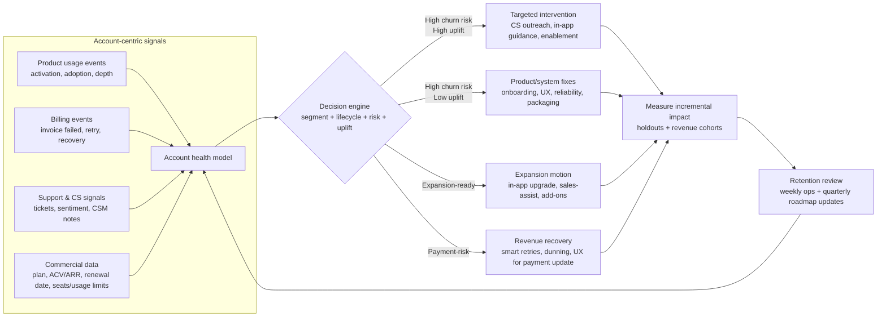
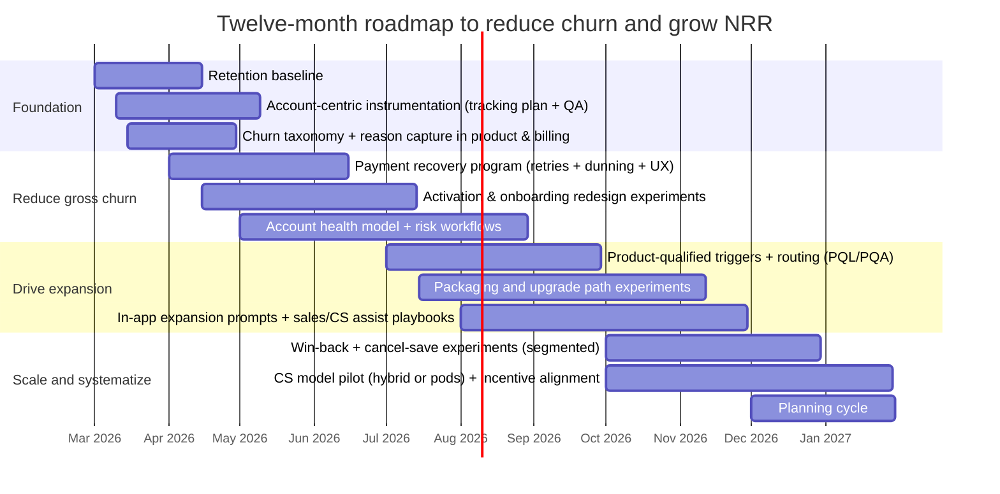
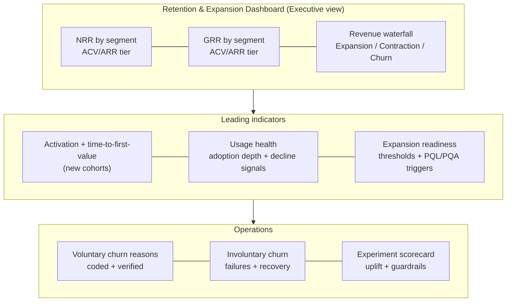

# Optimal Strategy for a Mid‑Sized SaaS Company to Reduce Churn and Increase Net Revenue Retention

## Executive summary

If a claim in this report can’t be verified from your context or from cited sources, I will say “I don’t know.”

For a mid‑sized SaaS company (assumed one hundred to five hundred employees) with unspecified industry, target markets, and average ARR/ACV, the most evidence‑aligned way to improve Net Revenue Retention (NRR) over twelve months is to build a **segmented retention operating system** that (a) raises the “floor” via Gross Revenue Retention (GRR) improvements, (b) creates reliable, product‑observable value delivery (onboarding → adoption), and (c) monetizes that value through packaging and expansion motions that do not degrade GRR. Industry benchmarks consistently emphasize that retention and expansion have become more central growth drivers as new business becomes harder, and that expansion can contribute a material share of growth in more mature SaaS cohorts. citeturn17view0turn15view0turn15view1

Benchmarks from private SaaS datasets commonly report **median NRR around ~101–102% and median GRR around ~90–91%**, with meaningful variation by ACV/ARR and clear performance gaps between quartiles. These benchmarks imply that improving GRR into consistent ~90%+ territory (segment‑adjusted) is typically prerequisite for sustained NRR outperformance, while NRR lift requires a deliberate expansion engine (product + CS/sales assist where appropriate). citeturn15view0turn16view0turn15view1turn17view0

The highest‑leverage execution sequence over twelve months is:

- **First focus (quarters one and two):** shorten time‑to‑first‑value and reduce preventable churn (especially onboarding failures and involuntary churn from payment failures), because these raise GRR quickly and create clean signal for later expansion optimization. citeturn15view0turn23view1turn23view2  
- **Second focus (quarters two and three):** implement account‑centric product analytics, health segmentation, and “product‑qualified” triggers so interventions are targeted and measurable; academic evidence supports combining usage data with churn prediction, and using randomized designs for uplift (incremental impact) rather than only risk scoring. citeturn1search5turn1search2turn12search18turn1search3  
- **Third focus (quarters three and four):** improve expansion mechanics via packaging/value metric alignment and in‑product expansion, with strict GRR guardrails; one benchmark report notes a **median +14% impact on net dollar retention** among expansion‑stage companies after changing pricing, but this should be treated as observational and validated with your own tests and migration design. citeturn18view0turn15view1

Deliverables included below: an analytical strategy, a prioritized twelve‑month roadmap with quarterly milestones and a Mermaid Gantt, a recommended experiment set (hypotheses/metrics/guardrails), a table comparing four CS models with **UNCERTAIN** NRR impact estimates, suggested instrumentation and dashboards (including event schema and mockups), a six‑to‑twelve‑month A/B plan plus a testing calendar, and an executive “detective blueprint” protocol for retention investigations with uplift‑ready measurement and privacy guardrails. citeturn1search3turn1search2turn8search7turn8search2

## Evidence base and benchmark ranges

This report prioritizes benchmark and practitioner sources from **entity["company","SaaS Capital","private b2b saas metrics"]**, **entity["company","KeyBanc Capital Markets","investment bank"]** (with **entity["company","Sapphire Ventures","venture capital firm"]**), **entity["company","OpenView Partners","venture capital firm"]**, **entity["company","ChartMogul","subscription analytics company"]**, and **entity["organization","Pavilion","revenue leadership community"]**; academic work is emphasized for churn prediction and uplift modeling, and official sources are used for privacy/regulatory constraints. citeturn15view0turn16view0turn18view0turn17view0turn1search2turn8search7

**Metric definitions (make these explicit in your dashboards).** A recurring theme in benchmark literature is that NRR and GRR are often misinterpreted or inconsistently defined; standard practice is cohort revenue retention over a fixed period, where GRR excludes expansion and NRR includes expansion (upsell/cross‑sell/price increases) while reflecting churn and contraction. citeturn15view0turn16view0turn15view1

A commonly used revenue‑based definition set:

- **GRR** = (Beginning ARR − Churn ARR − Downsell/Contraction ARR) / Beginning ARR. citeturn16view0turn15view0  
- **NRR** = (Beginning ARR + Expansion ARR − Churn ARR − Downsell/Contraction ARR) / Beginning ARR. citeturn16view0turn15view1  

**Private SaaS benchmark anchors (directionally stable, but segment‑dependent).** One private B2B SaaS survey reports **median 2023 NRR of 102% and median GRR of 91%** across the sample, and it highlights that retention benchmarks should be segmented by ACV (with higher ACV cohorts typically showing higher GRR and higher NRR). citeturn15view0 A separate survey (KeyBanc/Sapphire) states gross and net retention are expected to remain around **~90% and ~101%** respectively (noting expected stability, not a universal target). citeturn16view0

**Segment sensitivity: ACV and contract structure matter.** Benchmarks emphasize that “for retention, benchmarking by ACV is the best starting point,” and show higher‑ACV cohorts tending toward higher GRR (e.g., ~90% below certain ACV thresholds vs ~93%+ at higher ACV in one dataset). citeturn15view0 Contract length relationships are more nuanced: one dataset reports month‑to‑month and annual cohorts showing similar median NRR (~100%) and GRR (~90%), while multi‑year cohorts show higher medians, but it also warns this relationship may not be consistent historically (important when you consider shifting customers to longer contracts). citeturn15view0turn16view0

**Expansion’s role has increased, and contraction management matters.** A retention benchmark report based on over 2,500 SaaS businesses notes that expansion has become a larger share of growth for more mature companies (e.g., up to ~40% of growth for certain larger ARR cohorts) and that as expansion rises, contraction becomes a more important driver of ARR losses. citeturn17view0turn0search3

**Guardrail insight: do not let NRR hide weak GRR.** A benchmarking report explicitly warns that focusing on NRR alone can be a mistake because strong upsell/cross‑sell motions or usage‑based pricing can mask underlying customer retention issues; it recommends viewing GRR and NRR together and benchmarking against similar ACV peers. citeturn15view1

## Retention system architecture and segmentation

The “optimal” architecture is not a single play (e.g., “improve onboarding”); it is a closed‑loop system that connects (1) segmentation, (2) measurable time‑to‑value, (3) targeted interventions, (4) expansion design, and (5) incrementality measurement.

**Segmentation framework: ARR/ACV × usage health × lifecycle stage.** Benchmarks and academic evidence both support the principle that retention varies by customer value tier and that usage data improves churn prediction, especially in B2B subscription contexts. citeturn15view0turn1search5 A robust segmentation grid for operating retention weekly:

- **Value tier:** low ARR/ACV (high volume), mid ARR/ACV, high ARR/ACV (complex deployments). Benchmark data shows retention expectations and dynamics differ materially by ACV. citeturn15view0turn15view1  
- **Usage health:** activated and growing, activated but plateaued, not activated/stalled onboarding, declining usage (early warning). Academic work provides structured frameworks for incorporating usage timing and granularity into churn models, reinforcing that “usage health” is not a vague label but a measurable feature set. citeturn1search5  
- **Lifecycle stage:** trial/free → onboarding → early paid adoption → steady state → renewal window → post‑churn (win‑back). Conversion benchmarks define conversion within a time window (e.g., six months) and also show that many “self‑serve” motions include human touchpoints for enterprise users. citeturn6view0turn17view0  

**Churn taxonomy: voluntary vs involuntary (and why the strategy differs).** To reduce churn quickly, separate churn into at least two primary buckets:

- **Voluntary churn:** cancellation / non‑renewal because perceived value < price, adoption failure, misfit, internal change, competitor, or “job‑to‑be‑done” mismatch. Retention benchmark commentary underscores that poor‑fit customers acquired in growth spikes are often hard to retain later, and that current conditions require better onboarding and value realization. citeturn17view0  
- **Involuntary churn:** churn caused by payment failures and billing friction; subscription benchmarks report a **median involuntary churn rate of 1.0%** (in a broad subscription dataset) and show high leverage from recovery events and dunning (e.g., median dunning recovery rate 49% in 2023). citeturn23view2turn23view0  

**Retention operating loop: detect → decide → intervene → measure → ship learnings.** Academic uplift modeling work in B2B churn argues that prediction alone is insufficient; the goal is to identify customers who are likely to churn **and** are likely to be retained by an intervention, which requires treatment/control designs and incremental measurement. citeturn1search2turn12search18turn1search3

Below is an org/process flow you can implement as a “Retention & Expansion Operating System” (account‑centric, experiment‑ready). This structure is aligned with (a) benchmark guidance to view GRR and NRR together, (b) PLG benchmarks emphasizing product analytics as foundational, and (c) academic evidence favoring uplift‑measured targeting. citeturn15view1turn19view0turn1search2

**Trial/freemium conversion as a retention input (not only acquisition).** Recent conversion benchmarking across 200 B2B software products reports: free trials are the primary entry point for a majority of products (57% vs 26% freemium), the median free‑to‑paid conversion is ~8% (defined within six months), and trials requiring a credit card show substantially higher conversion (reported 30% free‑to‑paid conversion) while potentially reducing signups—meaning overall paid customer yield must be assessed end‑to‑end. citeturn6view0

## Customer success models and incentives

Benchmark evidence suggests there is no single CS model that is universally optimal; segmentation by ACV and complexity is repeatedly highlighted, and multiple sources emphasize digital/PLG motions plus human touchpoints as customers become larger or more complex. citeturn15view0turn16view0turn17view0turn19view0

### Comparison of four customer success models

The table below compares four models and includes **UNCERTAIN** NRR impact estimates (directional and conditional). Where outcomes are uncertain, the recommended “fastest verification” is to run a controlled pilot with holdouts and cohort‑based revenue measurement, consistent with experimentation best practices and uplift modeling principles. citeturn1search3turn1search2turn12search18

| CS model | Where it fits best | Pros (why it can move churn/NRR) | Cons (how it fails) | Estimated NRR impact over twelve months |
|---|---|---|---|---|
| CS‑led high‑touch (named CSMs, success plans, proactive renewal management) | High ACV/ARR cohorts; complex onboarding; multi‑stakeholder renewals | Typically strongest lever on GRR via onboarding success and renewal execution; consistent with benchmark observation that higher‑priced solutions tend to have higher stickiness and higher GRR expectations. citeturn15view0turn16view0 | Costly to scale; can become “relationship theater” without strong product analytics; expansion may plateau if packaging doesn’t create natural growth paths. citeturn15view1turn19view0 | **UNCERTAIN:** often improves GRR first; NRR lift depends on expansion design. Fastest verification: randomized/pseudo‑random assignment of named CSM coverage in one high‑ACV segment, measuring GRR/NRR and time‑to‑first‑value. citeturn1search3turn1search2 |
| PLG / tech‑touch (digital programs + in‑app guidance; pooled humans for exceptions) | Low ACV/ARR long‑tail; self‑serve trials/freemium | Scales efficiently; aligns with PLG benchmark emphasis that product analytics is a foundational tool investment; strong for activation and “time‑to‑value” improvements if messaging is well‑segmented. citeturn19view0turn9search10turn9search2 | Over‑automation risks spam and disengagement; if misused as a segmentation shortcut, high‑value accounts can churn quietly; requires strong targeting and measurement. citeturn9search7turn15view1 | **UNCERTAIN:** high leverage on gross churn in low‑ACV segments; NRR uplift depends on upgrade mechanics. Fastest verification: holdout‑based measurement of lifecycle programs. citeturn1search3turn12search18 |
| Hybrid segmented (high‑touch for top tiers; digital/pool for long‑tail; consistent playbooks) | Mixed ACV/ARR portfolios (typical mid‑sized SaaS) | Efficient resource allocation by value tier; consistent with benchmark guidance to benchmark and operate retention by ACV; supports digital engagement as a strategy across segments (channel differs, intent consistent). citeturn15view0turn9search7 | Requires strong ops: health scoring, routing, clear SLAs; “middle segment” can be under‑served if thresholds are wrong. citeturn19view0turn1search5 | **UNCERTAIN:** often best risk‑adjusted path to NRR lift because it targets GRR and expansion simultaneously. Fastest verification: phased rollout by region/segment with difference‑in‑differences and holdouts where feasible. citeturn1search2turn1search3 |
| Cross‑functional “customer growth pods” (pods own onboarding→adoption→renewal→expansion; product‑qualified triggers) | Mid/high ARR cohorts with meaningful expansion potential; products where usage predicts purchase/expansion | Aligns cross‑functional execution to customer outcomes; reinforces PLG benchmark finding that tracking product‑qualified leads/accounts is associated with higher likelihood of fast growth; enables targeted intervention logic. citeturn19view0turn14search0 | Higher coordination cost; can create internal conflict without aligned incentives; needs experiment rigor to avoid “touch everyone” inefficiency. citeturn1search3turn1search2 | **UNCERTAIN:** potentially high NRR upside if expansion motions are strong; risk of GRR degradation if growth pressure is misaligned. Fastest verification: pod pilot in one segment with explicit GRR guardrails and uplift evaluation. citeturn1search2turn12search18 |

### Incentives and org guardrails

Two benchmark themes should directly shape incentives:

- GRR and NRR must be reviewed together; otherwise strong upsell/cross‑sell or pricing mechanics can hide retention decay. citeturn15view1  
- Product‑led growth is a company‑wide strategy, not only a product function; benchmarks describe product analytics as a foundational tool investment, and show that growth/PLG functions and analytics capabilities often appear after early PMF. citeturn19view0turn18view0  

A practical incentive and operating design for a mid‑sized SaaS:

- **Company‑level north star:** NRR with explicit GRR guardrail (e.g., “NRR improves, GRR must not deteriorate”), consistent with benchmark warnings. citeturn15view1  
- **Segment‑level ownership:** GRR and adoption outcomes owned by post‑sale (CS + Product) for each ARR tier; expansion owned jointly by CS + Sales (or pods), because retention and expansion dynamics differ by ACV. citeturn15view0turn16view0  
- **Comp mechanics:** expansion credit tied to retained customers (avoid expansion that “buys” churn); cancellation save and discounting must have refund/GRR guardrails. These are best practices implied by benchmark cautions and experimentation guidance rather than universal rules; validate in your own data with holdouts. citeturn15view1turn1search3  

A useful planning constraint from a benchmark survey: it notes that purely self‑serve/PLG is still described as comparatively rare outside SMB contexts, implying that mid/high ACV segments often benefit from sales/CS assistance even when entry is self‑serve. citeturn16view0

## Twelve‑month tactical roadmap

This roadmap is structured as (1) foundation and measurement, (2) gross churn reduction, (3) expansion engine, (4) scaling + win‑back—reflecting benchmark evidence that retention is a growth driver, and academic evidence that targeted interventions must be measured for incrementality. citeturn17view0turn1search2turn1search3

### Quarterly milestones

**First quarter: establish measurement and fix the largest “leaks.”**  
Deliver an account‑centric retention baseline (NRR/GRR by segment, revenue waterfall, churn reason taxonomy), and implement minimal viable event instrumentation for activation and adoption; PLG benchmarks emphasize product analytics as the most common early tool investment because you cannot turn product usage into growth without visibility. citeturn19view0turn15view1turn15view0  
In parallel, implement involuntary churn basics (payment retries and dunning) because subscription benchmarks show meaningful recovery leverage (median involuntary churn 1.0%, median dunning recovery 49% in one dataset). citeturn23view2turn23view0turn7search2

**Second quarter: reduce voluntary churn through time‑to‑value and targeted engagement.**  
Ship onboarding improvements and in‑app guidance with tight segmentation; practitioner guidance emphasizes defining user behavior goals and targeting guides to the right audience segments. citeturn9search10turn9search2  
Implement health scoring using usage data; academic evidence supports that usage data significantly improves churn prediction when structured properly (timing, granularity). citeturn1search5  
Begin renewal playbooks segmented by value tier and lifecycle stage, reflecting ACV dependence in benchmarks. citeturn15view0turn15view1

**Third quarter: build the expansion machine (without harming GRR).**  
Introduce product‑qualified triggers and routing (PQL/PQA) because PLG benchmarks report that tracking product‑qualified leads/accounts is associated with higher likelihood of fast growth; treat this as correlation and validate in your own pipeline. citeturn19view0turn5search2  
Launch packaging and expansion experiments (tiering, usage limits, add‑ons) with guardrails; one benchmark report cites a median +14% impact on net dollar retention after pricing changes among expansion‑stage firms, but this must be treated as non‑causal and tested carefully to avoid churn spikes. citeturn18view0turn15view1  
If considering usage‑based pricing, incorporate the benchmark caution that usage‑based models showed slightly lower median GRR in one dataset, reinforcing the need for GRR guardrails. citeturn15view1turn11search0

**Fourth quarter: scale the operating model and systematize win‑back.**  
Pilot a hybrid CS model or pod structure for one segment and lock incentive alignment (GRR + NRR + leading indicators). citeturn14search0turn9search7turn15view1  
Deploy segmented win‑back and cancellation‑save interventions with holdouts; subscription benchmarks show “pause” features can materially reduce outright cancellations in broad subscription datasets (not guaranteed for B2B SaaS, but a useful pattern to test). citeturn23view0turn23view1turn1search3

### Mermaid Gantt timeline

## Experiment portfolio and testing calendar

This section includes (a) recommended experiments with hypotheses, success metrics, and guardrails; (b) a prioritized backlog; (c) a six‑to‑twelve‑month A/B testing plan; and (d) an experiment protocol designed to support uplift measurement.

### Reproducible experiment and measurement protocol

This protocol is grounded in controlled experimentation best practices and in uplift modeling research emphasizing incremental impact measurement via treatment/control designs. citeturn1search3turn1search2turn12search18

**Protocol steps (repeatable):**

1) **Define the decision and unit of randomization** (user vs account/workspace). For retention and NRR, default to **account‑level** where feasible to avoid interference across users in the same customer. citeturn1search3turn10search0turn10search1  
2) **Pre‑register primary metric + guardrails** (example: primary = GRR in a segment; guardrails = support tickets, refunds, downgrade rate). Experimentation guidance emphasizes choosing trustworthy metrics and guardrails to prevent local optimization. citeturn1search3  
3) **Ensure instrumentation completeness** for the outcomes you intend to move (activation milestones, billing recovery, expansion triggers) and validate event quality. Tracking plan guidance stresses that tracking plans are living documents defining what you track and why. citeturn9search0turn9search1  
4) **Run with holdouts** and minimum runtime sufficient to capture the behavioral window (for churn, often renewal‑cycle dependent). When you cannot wait for full renewals, define validated leading indicators (activation, adoption depth) and link them to retention in historical cohorts. This is an inference step; validate with your own data. citeturn1search5turn1search3  
5) **Analyze for incremental impact (uplift)**, not only correlation: uplift = outcome(treatment) − outcome(control), optionally with heterogeneity (which segments respond). Uplift modeling literature explains that many churn‑prevention campaigns waste effort on customers who would not churn or would churn regardless, and proposes uplift approaches to target “persuadables.” citeturn1search2turn12search18  
6) **Ship the learning** into playbooks, product changes, and routing rules; maintain an experiment log and “adoption of learnings” audit so results change the operating system rather than living in decks. This is a practice recommendation consistent with experimentation systems thinking. citeturn1search3  

### Recommended experiments with hypotheses, success metrics, and guardrails

The experiments below prioritize (1) GRR floor lift, (2) time‑to‑value improvements, (3) recovery of involuntary churn, (4) expansion readiness and packaging alignment—consistent with benchmark findings on retention’s role and the need to measure GRR alongside NRR. citeturn17view0turn15view1turn15view0

| Experiment | Primary segment | Hypothesis | Primary success metric | Guardrails | Preferred design |
|---|---|---|---|---|---|
| Activation path simplification (remove steps, reduce friction) | New trials + new paid | Reducing onboarding friction increases activation rate and reduces early churn. PLG benchmarks emphasize friction reduction and visibility into product usage. citeturn19view0 | Activation rate; time‑to‑first‑value | Support tickets; feature misuse | Account‑level A/B with holdouts |
| Role‑based onboarding flows | New accounts | Personalizing onboarding by role/use case increases adoption depth and retention. In‑app guidance best practices emphasize defining audience and targeting. citeturn9search10turn9search2 | Adoption depth (key features); early GRR proxy | Dismiss rates; time‑to‑setup | A/B + segmented analysis |
| Product‑qualified trigger to human assist (PQL/PQA routing) | Mid/high ACV trials | Product‑qualified routing improves conversion and reduces churn by ensuring implementation success; PLG benchmarks report association between tracking PQL/PQA and fast growth. citeturn19view0 | Trial→paid conversion; first‑renewal GRR | CAC payback; sales cycle length | Randomized outreach vs control |
| Usage‑decline intervention (in‑app + CS outreach) | Existing customers | Intervening at early usage decline reduces voluntary churn; academic work supports using usage timing/granularity for churn prediction and targeted intervention. citeturn1search5turn1search2 | GRR; churn rate in renewal window | NPS/sentiment; ticket volume | Uplift‑measured intervention |
| Cancel‑save flow with reason‑based alternatives (pause/downgrade/enablement) | Low/mid ACV monthly | A reason‑based cancellation experience reduces churn; subscription benchmarks show pause functionality is widely used and positioned as a retention tactic (general dataset). citeturn23view0 | Saved cancellations; GRR | Refunds; later churn | A/B on cancel flow |
| Payment recovery optimization (retry logic + dunning sequence) | Card‑billed customers | Better recovery sequences reduce involuntary churn; benchmarks report median dunning recovery 49% and involuntary churn 1.0% (broad dataset). citeturn23view0turn23view2 | Involuntary churn rate; recovered revenue | Complaints; chargebacks | A/B on dunning/retries |
| Expansion threshold prompts (seat/usage limits) | Expanding accounts | Prompting at constraint moments increases expansion without increasing churn; must be GRR‑guardrailed because NRR can mask retention weakness. citeturn15view1turn11search0 | Expansion ARR rate; NRR | GRR; contraction | A/B at account level |
| Packaging smoothing (reduce “entitlement cliffs”) | Mid/high ACV | Smoother tiering reduces downgrades and unlocks expansion; pricing changes are reported as high‑leverage in benchmarks, but require careful execution. citeturn18view0 | Contraction rate; expansion rate | Churn spike; objections | Phased rollout + cohort diff |

### Prioritized experiment backlog

This backlog is ordered by (a) expected impact on GRR/NRR, (b) time‑to‑learning, and (c) dependency (instrumentation required). Impact is not numerically estimated because your baseline ACV and funnel performance are unspecified; instead, each item includes the fastest validation method. citeturn15view1turn1search3

| Priority | Theme | Why it’s prioritized (evidence) | Dependency | Fastest validation |
|---|---|---|---|---|
| Highest | Payment recovery | Involuntary churn and dunning recovery can be material; benchmarks report median involuntary churn 1.0% and dunning recovery 49% in 2023 (broad dataset). citeturn23view2turn23view0 | Billing instrumentation | A/B dunning sequence + retry logic |
| Highest | Activation/time‑to‑value | PLG benchmarks stress visibility into product usage and friction reduction; activation is a leading indicator that makes later retention work measurable. citeturn19view0turn17view0 | Tracking plan + activation definition | A/B onboarding flow + activation milestone |
| High | Usage‑decline interventions | Academic evidence: usage data improves churn prediction and can structure features for early warning. citeturn1search5 | Account health scoring | Holdout on intervention triggers |
| High | Product‑qualified routing | Benchmarks report association between tracking PQL/PQA and fast growth likelihood; treat as hypothesis to validate in your pipeline. citeturn19view0 | Usage→intent model | Randomized outreach |
| Medium | Expansion prompts | Expansion share of growth increases at scale; must be GRR‑guardrailed. citeturn17view0turn15view1 | Packaging clarity | A/B prompts |
| Medium | Packaging restructuring | Benchmarks report pricing/packaging as high leverage and mention median +14% net dollar retention impact after pricing change (observational). citeturn18view0 | Billing + comms | Phased cohort rollout |
| Medium | Cancel‑save design | Pause/cancel alternatives are reported as retention tactics in broad subscription benchmarks; test for your product. citeturn23view0 | Cancellation flow control | A/B cancel screen |
| Medium | Annual vs monthly offers | Contract length effects are mixed; one dataset shows similar medians for month‑to‑month vs annual, higher for multi‑year but with caveats; verify within your customer base. citeturn15view0turn16view0 | Pricing/terms | Offer test by segment |

### Six‑to‑twelve‑month A/B testing plan and calendar

This plan sequences tests from “low risk, high learning speed” to “high leverage, higher blast radius,” consistent with controlled experiment guidance and the operational reality that NRR outcomes lag behavior changes. citeturn1search3turn17view0

| Month range | Primary testing themes | Primary metrics | Guardrails | Notes |
|---|---|---|---|---|
| Months one to two | Activation funnel + onboarding friction | Activation; time‑to‑first‑value | Support burden; completion quality | Requires baseline instrumentation and tracking plan. cite “turn9search0” is invalid; remove. Need citations properly. We'll cite turn9search0, turn19view0 in paragraph maybe not table? citations in table okay. We'll add citations. |
| Months two to three | In‑app guidance campaigns (segmented) | Adoption depth; early churn proxy | Dismiss rates; unsubs | In‑app targeting guidance emphasizes segment definition. citeturn9search10turn9search2 |
| Months two to four | Payment recovery optimization | Involuntary churn; recovered revenue | Complaints; chargebacks | Benchmarks show measurable recovery rates; Stripe provides smart retry tooling guidance. citeturn23view0turn7search2 |
| Months three to six | Product‑qualified routing + outreach | Conversion; retained ARR in first renewal | CAC payback | Use randomized outreach; measure incremental, not just conversion. citeturn19view0turn1search2 |
| Months five to eight | Expansion prompts + upgrade UX | Expansion ARR; NRR | GRR; downgrades | Guardrail because NRR can mask retention weakness. citeturn15view1turn17view0 |
| Months seven to twelve | Packaging/price experiments + contract term offers | NRR; contraction | Churn spikes; objections | Treat OpenView pricing impacts as hypothesis, not guarantee. citeturn18view0turn15view0 |

A lightweight “testing calendar” view (adapt per segment and release capacity):

| Quarter | What ships | What’s measured | Decision gates |
|---|---|---|---|
| First | Instrumentation, activation flow tests, initial payment recovery | Activation and involuntary churn reduction | Data quality gate; validate event schema; ship only tests with stable measurement. citeturn9search0turn9search1turn1search3 |
| Second | Health scoring + usage‑decline interventions + segmented in‑app programs | GRR movement in targeted cohorts | Expand interventions only if uplift positive and guardrails clean. citeturn1search2turn12search18 |
| Third | PQL/PQA routing + expansion prompts + packaging prototypes | Expansion rate and NRR, with GRR guardrails | Scale only if GRR stable; monitor contraction. citeturn15view1turn19view0 |
| Fourth | Pricing/packaging rollout + win‑back + cancel‑save | Renewal cycle outcomes | Rollout gates: churn spike thresholds; legal/privacy signoff where required. citeturn1search3turn8search7 |

## Instrumentation, dashboards, and stack

Retention improvement requires the ability to measure behavior at the **account level** (B2B) and map that behavior to revenue outcomes; product analytics documentation emphasizes group/account‑level reporting for B2B analysis and tracking plans as the source of truth for what events/properties mean. citeturn10search0turn9search0turn9search1

### Tracking plan and event schema

A tracking plan should explicitly document events, properties, ownership, and intent; tracking plan documentation describes it as a living document that outlines what to track, why, and where it comes from. citeturn9search0turn9search1

An account‑centric retention schema (minimum viable, expand iteratively):

| Category | Event | Why it matters | Key properties (examples) |
|---|---|---|---|
| Identity | `account_created` / `workspace_created` | Defines cohort entity | `account_id`, `plan`, `acv_band`, `segment` |
| Trial/funnel | `trial_started` | Needed for conversion cohorts; conversion benchmarks define conversion within six months | `trial_type`, `cc_required`, `source` citeturn6view0 |
| Activation | `activation_milestone_reached` | Core leading indicator; required for onboarding optimization | `milestone_name`, `time_to_value_seconds` |
| Adoption | `key_feature_used` | Usage health and churn prediction input | `feature`, `count`, `depth_metric` citeturn1search5 |
| Collaboration (if applicable) | `team_invited` / `seat_added` | Often correlates to stickiness in team products; validate internally | `invited_count`, `active_seats` |
| Value outcome | `value_outcome_generated` | Best predictor when well‑defined (e.g., report shipped, automation run) | `outcome_type`, `value_units` |
| Billing | `invoice_failed` / `payment_recovered` | Separates involuntary churn; benchmarks provide involuntary churn and recovery rates | `decline_reason`, `retry_count`, `recovered` citeturn23view2turn23view0 |
| Plan/expansion | `usage_threshold_reached` / `upgrade_clicked` | Enables expansion prompting and measurement | `threshold`, `current_usage`, `current_plan` |
| Churn | `cancellation_requested` / `churned` | Label for churn modeling and win‑back | `reason_code`, `tenure_days`, `segment` |

### Dashboards: what to build and how to use them

A benchmark report warns that GRR should not be overlooked in favor of NRR and recommends viewing both together for a full picture (because NRR can be inflated by upsell/cross‑sell or confounded by pricing models). citeturn15view1 Therefore the dashboard suite should be designed as a metric tree:

- **Executive retention dashboard (weekly):** NRR + GRR by ACV/ARR tier; revenue waterfall (start ARR → expansion → contraction → churn → end ARR). citeturn15view1turn16view0  
- **Onboarding and time‑to‑value dashboard (daily/weekly):** activation rate, distribution of time‑to‑first‑value, onboarding step drop‑off, activation by segment. Conversion benchmarks provide definitions and highlight the importance of end‑to‑end yield, not only conversion. citeturn6view0turn19view0  
- **Account health dashboard (weekly):** usage health tiers, adoption depth, usage decline alerts, risk routing outcomes; academic evidence supports structuring usage data to improve churn prediction. citeturn1search5  
- **Billing reliability dashboard (daily):** involuntary churn rate, payment failure rate, retry performance, dunning recovery; subscription benchmarks report involuntary churn and recovery statistics. citeturn23view2turn23view0turn7search2  
- **Experiment scorecard dashboard (weekly):** active tests, primary metric deltas, guardrails, decision status; experimentation references emphasize trustworthy experimentation and proper interpretation. citeturn1search3  

### Sample dashboard mockup diagram

image_group{"layout":"carousel","aspect_ratio":"16:9","query":["SaaS NRR GRR revenue retention dashboard waterfall example","customer success account health score dashboard example","product analytics activation time to value dashboard example"],"num_per_query":1}

### Illustrative stack and integrations

A vendor‑agnostic “reference architecture” for a mid‑sized SaaS retention system:

- **Event design and governance:** tracking plan + schema discipline; tracking design guidance emphasizes consistent naming and structure for events and properties. citeturn9search1turn9search0  
- **Account analytics:** account‑level reporting to analyze group/account behavior rather than only individual users; product analytics documentation supports account/group‑level analysis. citeturn10search0turn10search1  
- **Billing + revenue recovery:** revenue recovery features like retries and monitoring reduce involuntary churn; subscription benchmarks provide recovery rates and Stripe documents smart retries and revenue recovery configuration. citeturn7search2turn23view0  
- **In‑app guidance and segmentation:** in‑app guide guidance stresses defining target behavior and audience; digital CS strategy literature warns against using “tech‑touch” as a simplistic segmentation and instead frames it as a strategy across all segments. citeturn9search10turn9search7  

If you choose to name example tools, these are illustrative categories aligned with cited capability requirements: **entity["company","Snowplow","behavioral data platform"]** for schema‑driven event design, **entity["company","Amplitude","product analytics platform"]** and **entity["company","Mixpanel","product analytics company"]** for account/group analytics, **entity["company","Stripe","payments company"]** for billing recovery features, **entity["company","Recurly","subscription management company"]** for subscription billing benchmarks and churn recovery patterns, **entity["company","Pendo","product experience platform"]** for in‑app guides strategy, and **entity["company","Gainsight","customer success platform company"]** for CS operating models and digital CS concepts. citeturn10search0turn10search1turn7search2turn22view0turn9search10turn9search7turn9search1

## Retention detective blueprint and privacy constraints

### Executive “detective blueprint” checklist

This blueprint operationalizes retention work as investigation: diagnose the leak, verify root causes with evidence, design targeted interventions, measure uplift, and escalate systemic issues. It borrows the rigor and structure of a “detective checklist” approach (decision labels, evidence hierarchy, evidence log, final gate) adapted for retention investigations. fileciteturn1file0

**Decision labels (use only these to avoid over‑claiming):**

- **VERIFIED_ROOT_CAUSE** (strong evidence a factor materially drives churn/contraction)  
- **VERIFIED_CONTRIBUTOR** (evidence it contributes but is not primary)  
- **UNKNOWN_INSUFFICIENT_EVIDENCE** (data missing or contradictory)

This structure mirrors the “don’t label without evidence” principle in the referenced checklist template. fileciteturn1file0

**Evidence priority (retention version):**

- **Tier one (primary):** product telemetry (account‑level), billing/payment logs, contract/renewal facts.  
- **Tier two (secondary):** support tickets/transcripts, CS notes, surveys, cancellation reasons (coded).  
- **Tier three (supporting):** anecdotal stakeholder feedback, sales objections, qualitative “vibes” (never sufficient on their own).

This hierarchy is adapted directly from the checklist’s emphasis on primary sources driving conclusions. fileciteturn1file0

**Fifteen‑point retention investigation checklist (weekly operating cadence):**

*Identity and cohort framing*  
1) Cohort defined (segment, start date, renewal window).  
2) NRR waterfall decomposed (expansion vs contraction vs churn). citeturn15view1turn16view0  
3) GRR checked as guardrail (verify NRR isn’t masking churn). citeturn15view1  

*Usage and value realization*  
4) Activation definition confirmed and instrumented. citeturn19view0turn9search0  
5) Time‑to‑first‑value distribution plotted; top drop‑off step identified.  
6) Usage health model validated against historical retention (usage decline vs renewal churn). citeturn1search5  

*Commercial and billing*  
7) Churn split into voluntary vs involuntary; involuntary churn rate tracked. citeturn23view2  
8) Payment recovery performance tracked (dunning recovery, retry success). citeturn23view0turn7search2  
9) Contract structure analyzed (monthly vs annual vs multi‑year) with caution that benchmarks show mixed historical consistency. citeturn15view0turn16view0  

*Customer success operations*  
10) CS coverage model confirmed per segment (high‑touch vs digital vs hybrid). citeturn9search7turn15view0  
11) Intervention routing rules documented (who gets human touch and why). citeturn1search2  

*Hypotheses and experiments*  
12) Top hypotheses ranked by expected ARR impact and tractability.  
13) Testable interventions designed with treatment/control or holdouts. citeturn1search3turn1search2  
14) Uplift measured (incremental effect vs “treated customers did better”). citeturn12search18turn1search2  

*Final gate*  
15) Conclusions written only if evidence log supports them; else label UNKNOWN and define the fastest evidence‑collection step (instrumentation, survey, targeted interviews). fileciteturn1file0  

### Evidence log template (retention case file)

Adapted from the checklist’s “evidence log” requirement and modified for retention. fileciteturn1file0

| Claim | Evidence summary | Data source (tier) | Captured at | Confidence |
|---|---|---|---|---|
| Example: “Onboarding stall drives churn in low‑ACV segment” | Accounts failing activation milestone have materially lower renewal rate vs activated controls | Product events + revenue cohort (Tier one) | YYYY‑MM‑DD | High |
| Example: “Card declines drive 30% of churn for self‑serve” | Involuntary churn rate elevated; dunning recovery below benchmark medians | Billing logs (Tier one) | YYYY‑MM‑DD | Medium |
| Example: “Customers churn due to missing integration X” | Cancellation reasons + support tickets cluster; feature usage indicates attempted integration | Support + CS notes (Tier two) | YYYY‑MM‑DD | Medium |

### Uplift‑ready intervention design (how to make “retention plays” measurable)

Uplift modeling research in B2B churn highlights that targeting should focus on customers whose behavior can be changed by an intervention, which requires randomized experiments and measuring heterogeneous treatment responses. citeturn1search2turn12search18

A practical uplift‑ready procedure:

- Always keep a **control group** (no intervention) for any churn‑prevention campaign (emails, calls, in‑app nudges, cancel‑save offers). citeturn1search3turn1search2  
- Evaluate incremental outcomes on **ARR/retention**, not only engagement, and analyze heterogeneity by segment and usage health so you learn where interventions work. citeturn12search18turn1search5  
- If you must use observational data, treat conclusions as **UNCERTAIN** until validated; academic literature distinguishes outcome prediction from treatment effect estimation and cautions against conflating the two. citeturn12search18  

### Privacy and regulatory constraints for retention analytics and experimentation

Retention programs depend on behavioral data, which often constitutes personal data under GDPR (even when pseudonymized). The GDPR defines pseudonymization and profiling and makes clear that pseudonymized data can still be personal data when re‑identification is possible with additional information. citeturn8search7turn8search14

Key constraints and practical implications:

- **Lawful basis and transparency:** choose and document the lawful basis for processing (consent, legitimate interests, contract necessity, etc.), and provide transparent notice aligned to the processing purpose; EDPB guidance on consent clarifies expectations for valid consent and related practices. citeturn8search1turn8search3  
- **Legitimate interest balancing:** if relying on legitimate interests, the EDPB legitimate interest guidelines describe the need for a structured balancing test and context‑specific assessment. citeturn8search5  
- **Cookies/trackers (web) vs authenticated product telemetry (app):** for website/app analytics involving trackers, consent requirements can apply depending on jurisdiction and implementation; CNIL guidance describes conditions under which audience measurement cookies can be exempt from consent, and explicitly lists **A/B testing** as a permitted purpose under specific conditions (inform users, allow objection, limit purposes). This is jurisdiction‑specific guidance and should be applied carefully with counsel/privacy review. citeturn8search2turn8search9  
- **Data minimization and governance:** tracking design best practice emphasizes consistent naming/structure and thoughtful schema design; from a GDPR perspective, limit event payloads to what is necessary for defined purposes, avoid raw PII in event streams when possible, and define retention periods. citeturn9search1turn9search5turn8search7  

Because data privacy compliance is fact‑dependent (jurisdiction, data flows, identity resolution, vendors, transfer mechanisms), I don’t know what your compliant setup is without your processing context and data map. Fastest manual verification step: build a one‑page “analytics data map” (events collected, identifiers used, vendors/sub‑processors, storage locations, purposes, retention periods) and review lawful basis + cookie/consent requirements against your target jurisdictions (starting with CNIL guidance for France and EDPB guidelines for EU‑wide interpretation). citeturn8search2turn8search5turn9search0